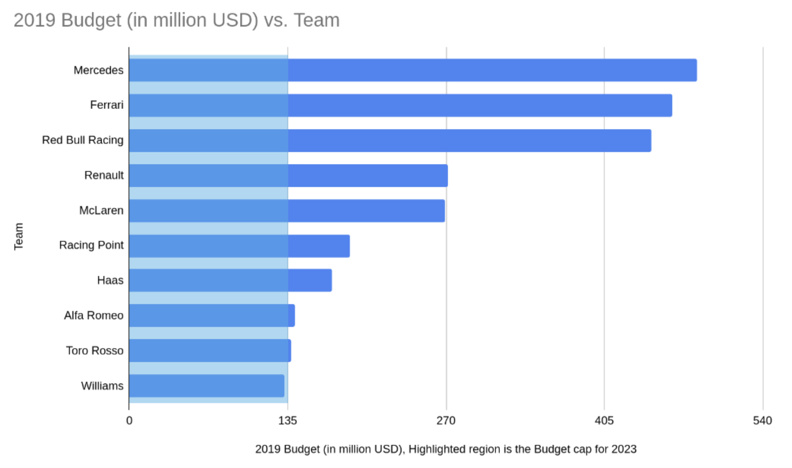
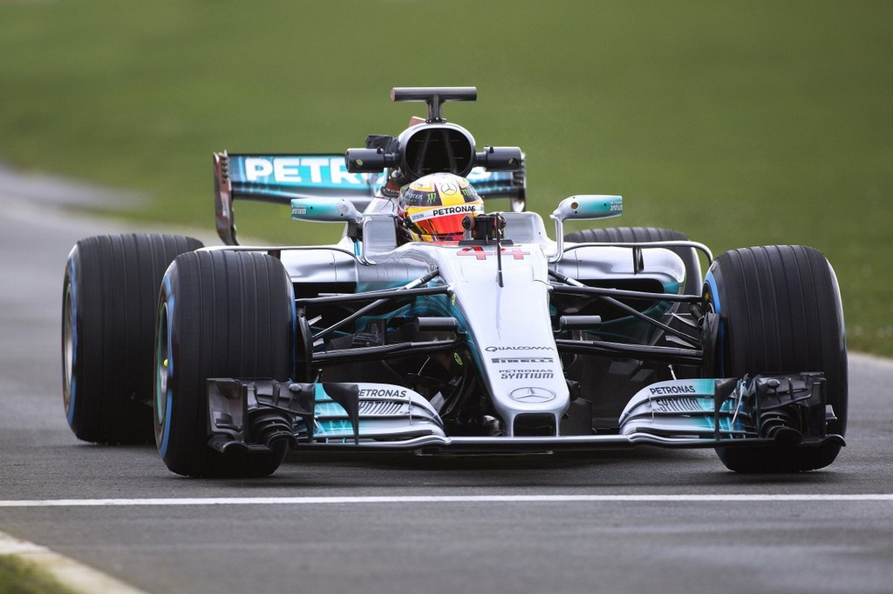

Lewis Hamilton's famous quote, "money is not something that drives me," perfectly captures the paradox of Formula One. While financial rewards might not be the sole motivator for elite drivers, F1 operates on a mammoth financial scale, burning through cash at rates that would make even a billionaire blink. Buckle up, as we delve into the intricate web of F1's finances, exploring how this multi-billion dollar industry makes money and the staggering costs required to keep this adrenaline-fueled spectacle running.

## Team budgets

Top-tier teams like Mercedes and Ferrari are financial juggernauts, wielding budgets that would make a small nation envious. In 2019, Mercedes, holding the title for the largest budget, spent a total of $484 million (Rs 3,388 crore , according to USD rate in 2019) during the F1 season, while Ferrari allocated $463 million (Rs 3,241 crore) [1]. Recognizing the significant gap in budgets among teams, the "Fédération Internationale de l'Automobile" (FIA), the governing body of F1, implemented a cost cap of $145 million starting from the 2021 season, with the budget cap for 2023 set at $135 million.

 

    <figure class="col-md-12">
        
        <figcaption>Data source: <a href="https://www.essentiallysports.com/">essentiallysports.com</a></figcaption>
    </figure>

 

Understanding Formula 1's cost caps necessitates grasping the magnitude of expenditures in the sport and the disparities in their distribution among teams. In the 2019 season, the combined budgets of the top three teams—Mercedes, Ferrari, and Red Bull—exceeded 50% of all team budgets combined. Conversely, the budgets of the bottom three teams—Alfa Romeo, Toro Rosso, and Williams—accounted for just over 15%. Notably, Mercedes, Ferrari, and Red Bull secured the top three positions in that season, while Alfa Romeo, Toro Rosso, and Williams occupied the 8th, 6th, and 10th spots, respectively.

The budget cap for each F1 team in 2023 was $135 million, equivalent to approximately Rs 1,124 crores which surpasses the combined auction funds (Rs 1,100 crores) for all 11 IPL teams. The staggering sums of money invested in Formula 1 racing underscore the enormity of the financial scale involved.

## F1 expenses

Running a Formula 1 team is a complex endeavor that demands meticulous management of various expenses. A significant portion of a team's budget, around 25-30%, is allocated to personnel costs, covering salaries for top-tier engineers, aerodynamicists, mechanics, and pit crews. Star drivers like Lewis Hamilton can command staggering salaries, with reports suggesting figures around $50 million annually.

Additionally, logistical operations are critical, with each Grand Prix weekend requiring the transportation of extensive equipment and personnel across the globe. This logistical challenge, along with hospitality expenses and travel costs, can consume another 20-25% of the budget. Furthermore, a substantial investment, often upwards of 30%, is dedicated to research and development (R&D). This includes the development of cutting-edge aerodynamic components, optimization of powertrains, and crafting lightweight yet durable chassis.

These figures underscore the immense financial stakes involved in Formula 1. From the expertise of engineers to the talent of drivers and global logistics, every element carries a hefty price tag.

## Sponsorships

While the on-track battles are fierce, an equally competitive fight unfolds behind the scenes: the battle for lucrative sponsorship deals. With a staggering 1.9 billion viewers globally tuning in to Formula 1 in 2023, it stands as one of the most widely watched sporting events worldwide. This vast audience represents a lucrative opportunity for sponsors.

Securing a prestigious title sponsorship can yield over $100 million annually for a company. These sponsorships offer prime placement of brands on cars, team uniforms, and racetracks, greatly enhancing their visibility to a global audience.

However, sponsorship in Formula 1 extends beyond mere branding. Many sponsors, particularly automotive manufacturers, use their partnerships in F1 to showcase their technological expertise. They develop cutting-edge racing components that often find their way into their consumer vehicles, demonstrating their innovation to a worldwide audience.

## Steep price tag of a driver

 

    <figure class="col-md-12">
        
        <figcaption>Max Verstappen, Source: <a href="https://www.bbc.com/sport/formula1/articles/c4gl5gp57y3o">BBC sports</a></figcaption>
    </figure>

 

Speaking of costs, we have to mention the cost of becoming a driver too. The path to Formula One is paved with millions, with estimates suggesting a total cost of $5 million to $10 million from childhood karting to the pinnacle of motorsport. Even the entry point, karting, can guzzle up to $100,000 a year. This isn't just for the fancy car – it covers coaching, travel, equipment, and even renting the kart itself. As young drivers progress through the ranks to Formula 4, Renault, and ultimately F2, the costs skyrocket, demanding ever larger sums for increasingly sophisticated cars and bigger teams. Sponsorships exist, but they're few and far between.

Look at Lance Stroll, the son of a Canadian fashion billionaire, who reportedly received a whopping $85 million from his father to fund his racing career. Max Verstappen, the reigning champion, is another example. He was practically born into racing, with his father, a former F1 driver, providing substantial financial backing throughout his early years.

Although a few exception to te above do exist, like Seven-time champion Lewis Hamilton rose from a modest background in England. His father tirelessly worked multiple jobs to support Lewis's go-karting dreams. Kimi Räikkönen, another champion, comes from humble beginnings in Finland. His family even went as far as selling their house to finance his early karting career.

The given examples highlight the fact that although a middle class teenager can rise to be an F1 driver, it did cost their family an arm and a leg to get through, which honestly not all parents would. The reality is stark: with these kinds of financial hurdles, F1 is a sport reserved for the ultra-wealthy, making it a playground for rich kids rather than a true meritocracy of talent.

## F1’s increasing annual revenue

Liberty Media, the owners of Formula 1's commercial rights, recorded a significant 25% increase in the annual revenue generated by the motorsport event, rising from $2.573 billion to $3.222 billion. This marks a notable achievement for the company. Furthermore, the operating profit also saw a substantial boost of 64%, climbing from $239 million to $392 million, showcasing the effectiveness of their business strategies.

The rise in revenue can be attributed primarily to heightened fan engagement. In 2018, the average viewership was 554,000, but in 2023, it was 1.11 million, a nearly 100% increase. Media rights and contracts are directly influenced by fan demand. Increased fan interest leads to more substantial and lucrative media agreements. Formula 1 sells broadcasting rights to global television and streaming platforms, which significantly contribute to its income.

## The prize money

Formula One teams revel in the glory of podium finishes with champagne showers, but the financial reality behind the glamour is intricate. While prize money is distributed based on championship standings, it represents only a fraction of a team's overall expenditure. Picture a billion-dollar pot divided among ten teams – while Mercedes or Red Bull might rake in well over $100 million, teams like Haas or Williams, often fighting for the bottom rungs of the championship, receive a significantly smaller slice.

The prize money in Formula One, while substantial, barely scratches the surface of the immense costs involved in running a team. Developing cutting-edge cars, maintaining a fleet of high-performance machines, and assembling a top-notch engineering team all demand vast sums of money. Sponsorship serves as the lifeblood that sustains these teams.
Major brands vie for prominent placement on cars and driver attire, with their logos translating into millions of dollars in annual funding.

## The big budget teams

 

    <figure class="col-md-12">
        
        <figcaption>Mercedes F1 car, Source: <a href="https://gaadiwaadi.com/">gaadiwaadi.com</a></figcaption>
    </figure>

 

For companies with deep pockets, finances paint a different picture. Prize money, though substantial, is just a sliver of a team's budget. A $1.157 billion pot (in 2022) might seem like a windfall, but some top teams, like Mercedes, the dominant force for years, could likely operate at a loss.

Mercedes' advantage lies beyond the racetrack. The team is a powerful marketing tool for its parent company, Daimler. Every win, every podium finish translates to global brand recognition.  Imagine the value of having Lewis Hamilton, a seven-time World Champion, endorse your car brand. This intangible benefit is priceless. So, even if Mercedes F1 operates at a loss, (which a $85 billion worth company easily can), the non-financial benefits for the brand as a whole are undeniable.

## The low budget teams

While top teams might secure over $100 million, lower-ranked teams could receive as little as $20-30 million. This meager sum barely scratches the surface of their expenses. Developing a competitive car requires hundreds of millions, and maintaining a high-performance machine across a grueling season devours vast resources.

The real stranglehold comes from attracting sponsors. Unlike frontrunners battling for podiums and global exposure, these teams struggle to offer attractive packages. Broadcast time shrinks with lower positions, meaning less brand visibility for potential sponsors. This creates a brutal cycle.

Without significant financial backing, they lack the resources to develop a competitive car, hindering their ability to fight for points and media presence. The lack of results makes them even less appealing to sponsors, creating a financial noose that has choked out several promising teams over the years. Caterham and Manor are just two examples of once-hopeful teams that succumbed to the financial pressures at the bottom of the grid.

## The budget cap (which didn’t help)

Formula One's introduction of a budget cap, initially aimed at leveling the playing field, has instead exposed underlying disparities. Despite a purported $145 million limit, this figure pales in comparison to the extravagant spending habits of powerhouses like Mercedes and Red Bull, which previously operated with budgets well over $400 million. While touted as a measure to rein in excessive expenditures, loopholes and pre-existing advantages allow these titans to maintain their competitive edge.

Years of lavish spending have facilitated the construction of opulent facilities, cutting-edge wind tunnels, and the accumulation of top-tier staff expertise, luxuries beyond the reach of smaller teams under the cap. It's akin to imposing a speed limit on a Ferrari while allowing a Smart car to retain its souped-up engine. The consequence? Another season dominated by the same affluent teams, albeit with slightly tighter purse strings.

Notably, this year's budget cap was reduced to $135 million, yet the top teams retained their dominance. Interestingly, while smaller teams welcomed the cap, many were unable to utilize their allocated budget due to financial constraints fully, underscoring the challenges faced by those with limited resources in a sport where financial might often dictates success.

## Concluding

 

    <figure class="col-md-12">
        
        <figcaption>Audience at Formula 1, 2019 season. Source: <a href="https://www.formula1.com/">formula1.com</a></figcaption>
    </figure>

 

In conclusion, Formula One presents a captivating contradiction. While driven by intense passion and cutting-edge technology, the sport's foundation is intricately tied to complex financial dynamics and influence. From the substantial multi-million dollar budgets to the financial struggles faced by lower-ranked teams, F1's financial landscape portrays a narrative of both opulence and inequality. Despite the recent introduction of a budget cap aimed at fostering fairness, its effectiveness in leveling the playing field remains uncertain. Whether Formula One can bridge the financial gap and establish a genuine meritocracy where talent prevails is a question yet to be answered. However, one undeniable fact emerges: the financial intrigue unfolding behind the scenes of the high-speed races is as captivating as the battles witnessed on the track itself.

## References

[1] *Budgets for all 10 Formula One Teams in 2019* 
[https://www.essentiallysports.com/what-are-the-budgets-for-all-10-formula-one-teams-2019/](https://www.essentiallysports.com/what-are-the-budgets-for-all-10-formula-one-teams-2019/)

[2] *How much money can F1 bring to the race city organizer?* 
[https://en.as.com/racing/how-much-money-can-f1-bring-to-the-race-city-organizer-n/](https://en.as.com/racing/how-much-money-can-f1-bring-to-the-race-city-organizer-n/)
