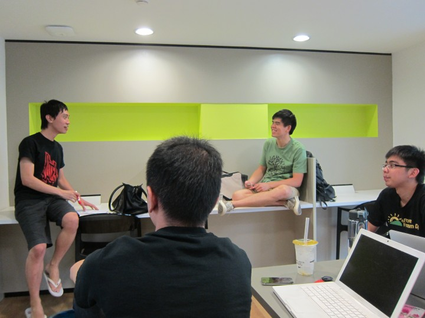
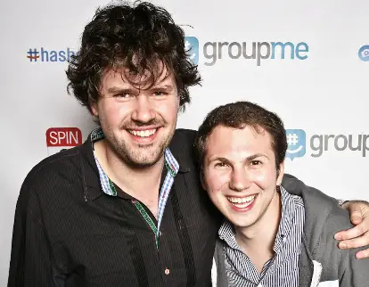

E-Cell recently hosted its flagship event, Megathon, Hyderabad’s largest student-run hackathon. Students from across the country took part in the unforgettable event. Dozens of teams showcased innovative solutions to challenges in fields ranging from natural language processing to computer vision. But as I watched these budding innovators meet, ideate, and hack, a thought struck me: what if these ideas didn’t just stay within the hackathon? What if they were the catalyst for something bigger? As I dug deeper into the history of hackathons, I discovered stories that were nothing short of awe-inspiring.

Around the world, hackathons have been ground zero for various disruptions and innovations in spaces as diverse as e-commerce to online communication.

## Carousell

 

    <figure class="col-md-12">
        
        <figcaption>Lucas Ngoo and Quek Siu Rui; Credits: Tech in Asia</figcaption>
    </figure>

 

Carousell is an e-commerce platform selling new and second-hand goods. It is also one of Singapore’s most recent unicorns, achieving the prized billion-dollar valuation in 2021, just nine years after its inception at Startup Weekend Singapore 2012.

Back then, Carousell’s co-founders Lucas Ngoo and Quek Siu Rui were both students at the National University of Singapore (NUS), pursuing computer engineering and business management, respectively. They decided to take part in the 54-hour Startup Weekend Singapore hackathon as a way of perhaps creating “a fun project that could solve a meaningful problem”. Through the event, they were able to receive meaningful feedback to improve their product. But more importantly, they received significant praise and found that the idea really resonated with the audience and judges.

However, it wasn’t all smooth sailing. In fact, they initially struggled to gain traction amongst the vast sea of competitors. Before the hacking even began, the potential participants were subject to an initial screening round and a further pitching round. 40 of the 80 teams would be given the chance to move onto the pitching round. Carousell, then called “SnapSell”, barely missed the mark, ranking around 42. However, as luck would have it, a few teams pulled out, giving Ngoo and Quek the chance to present their idea. But their troubles didn’t end there. Even after the pitching round, the team almost didn’t make the list for the next round – once again, saved by the consolidation and withdrawal of a few teams.

Their fortunes changed during the hacking phase, where their idea would come to fruition and would end up clinching the top spot at Startup Weekend. The prize included a scholarship to the Founder Institute, the world’s largest pre-seed startup incubator. Moreover, it awarded them office space to get to work on their game-changing idea.

However, it wasn’t the funding or the office space which gave the aspiring founders the confidence to embark on this journey. It was the enthusiasm their idea garnered. Quek remembers how “\[they] collected a few hundred emails from our landing page, and \[they] even received tweets asking if they could download the app right away”. They were able to see the potential that the idea had in real-time, which “gave \[them] confidence to take the idea forward, put together a team, and take the plunge to do this full time”.

Today, Carousell employs over a thousand people and has been the platform of choice for thousands of vendors and millions of transactions. And it all started from a simple idea at a hackathon.

## GroupMe

 

    <figure class="col-md-12">
        
        <figcaption>Steve Martocci and Jared Hecht; Credits: Business Insider</figcaption>
    </figure>

 

While Ngoo and Quek enjoyed breakout success at Startup Weekend, Steve Martocci and Jared Hecht would not be so lucky. The two software engineers came up with the idea for GroupMe a few days before TechCrunch Hackday in May 2010. Today, the idea of a real-time group chat may seem trivial but it was not so simple in the early 2010s.

Back then, group chatting was almost exclusively restricted to computers and mobile communication happened through long and drawn out email chains. These chains worked if participants talked over a long period of time. But let’s say you were at a concert and wanted to talk to your friends in real-time. Email chains would break down almost instantly due to delays in sending and receiving. This is precisely the problem which frustrated Martocci’s fiancé.

In response, the two budding co-founders got together and built GroupMe during the 24-hour Hackday. The app would allow for instantaneous communication over the internet, long before Apple unveiled iMessage and while WhatsApp was still in its infancy. While the idea might seem extremely useful to us today, the judges and audience at TechCrunch were not impressed.

Yet, the duo did not give up and the co-founders’ friends started using the app en masse, with word quickly spreading of this new innovation. The app rapidly gained momentum, convincing Martocci and Hecht to quit their jobs to pursue work on GroupMe full-time later that year. By December, their efforts had paid off and 450,000 messages were being exchanged over the platform every single day.

Eventually, just 370 days after launching, GroupMe would be purchased by Skype for $85 million. Even today, despite stiff competition, GroupMe continues to operate under Microsoft’s aegis, serving millions of users.

## Conclusion

Carousell and GroupMe both started out as projects created during the rush of a hackathon. However, the ways these companies were perceived upon inception could not have been more different. Carousell was praised and funded from the get-go, while GroupMe had a much rougher start, growing through word-of-mouth after failing to achieve significant traction at TechCrunch HackDay.

The one factor which united these startups, separated by industries and oceans, was the grit and hard work put in by their founders. Despite not achieving instant success, Martocci and Hecht did not give up on their idea. Instead, they stuck with it and even quit their jobs to pursue their dream. Despite the initial setbacks, GroupMe became one of the most popular online chatting platforms and ended up contributing to the now ever-present phenomenon of real-time group chatting.

Meanwhile, Quek and Ngoo were not satisfied with just winning a prize at a hackathon. They wanted to make their idea into a global marketplace, serving millions of consumers. To that end, they poured years of their lives into what is now one of Asia's largest e-commerce platforms.

Hackathons aren’t about winning a prize. They’re about coming together to build something new, something disruptive, something which can change the world. It’s not the applause or accolades that define the experience – it’s the passion, creativity, and dedication you bring to building something new, even if its impact isn’t immediately seen.

## References

[1] *Two rare Hackathon success stories* 
[https\://www\.techinasia.com/two-rare-hackathon-success-stories](https\://www\.techinasia.com/two-rare-hackathon-success-stories)

[2] *leadiQ Carousell Group* 
[https\://leadiq.com/c/carousell-group/5a1d98862300005400873698](https\://leadiq.com/c/carousell-group/5a1d98862300005400873698)

[3] *Carousell – The Early Years* 
[https\://blog.carousell.com/carousell-pro-tips/featured-spotlight/carousell-early-years/](https\://blog.carousell.com/carousell-pro-tips/featured-spotlight/carousell-early-years/)

[4] *How GroupMe Sold For $85 Million Just 370 Days After Launch* 
[https://www.businessinsider.com/what-is-groupme](https://www.businessinsider.com/what-is-groupme)

[5] *How a Multimillion-Dollar Business Grew Out of a Hackathon* 
[https://www.ideaconnection.com/open-innovation-success/How-a-Multimillion-Dollar-Business-Grew-Out-of-a-Hack-00788.html](https://www.ideaconnection.com/open-innovation-success/How-a-Multimillion-Dollar-Business-Grew-Out-of-a-Hack-00788.html)
