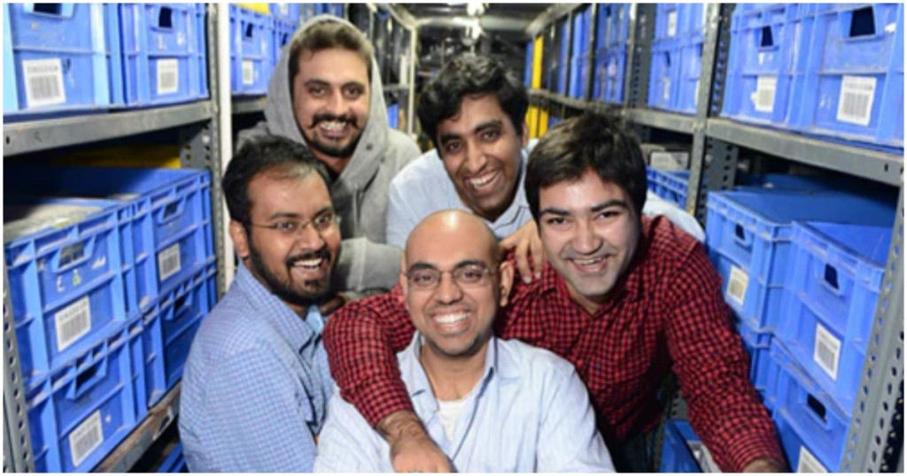
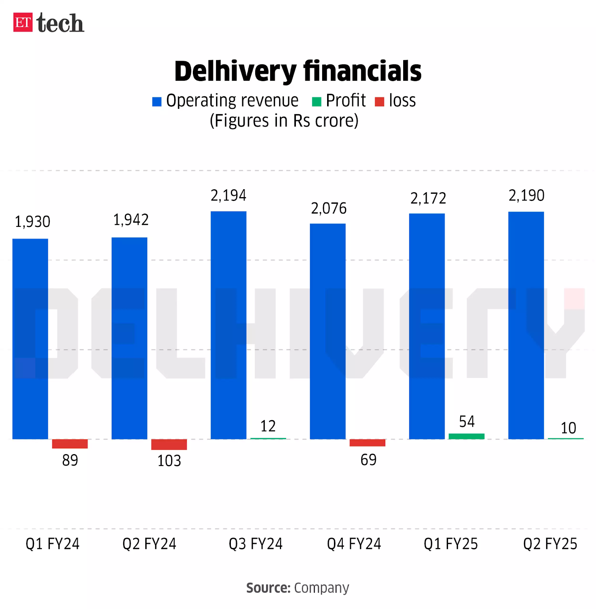

As the sun dipped low over Gurugram, Suraj Saharan found himself deep in thought within the glass-walled headquarters of Delhivery. It was a moment of reflection on the remarkable journey that Delhivery had undertaken since its humble beginnings. From its roots as a restaurant food delivery service, Delhivery has blossomed into India's largest integrated 3rd Party Logistics Service Provider.

Delhivery had initially ventured into the e- commerce sector with a mission to revolutionize logistics. Faced with challenges like delayed cash cycles and tedious processes, it embarked on a path of innovation. Today, it stands tall, offering a plethora of services including express parcel delivery, partial and full-truck loading, cross-border supply chain, and warehousing.    

With its unwavering commitment to efficiency and customer satisfaction, Delhivery has become synonymous with reliability and excellence in the logistics industry, serving every pin code in the country with the lowest cost network. This article takes a deep dive into the journey of the company, including the strategies that contributed to its success.

## From humble origins

 

    <figure class="col-md-12">
        
        <figcaption>Delhivery Founders. Image Source: <a href='https://officechai.com/startups/delhivery-unicorn/'>OfficeChai</a></figcaption>
    </figure>

 

The founding story of Delhivery is a tale of entrepreneurial vision and adaptability, rooted in the vibrant landscape of India's burgeoning e-commerce industry. It all began with Sahil Barua's entrepreneurial aspirations during his time at IIM Bangalore, where he envisioned a model to assist startups in scaling up their operations.

The Indian e-commerce revolution had its modest beginnings with online ticket bookings by the Indian Railways in 2002. However, the true turning point came with Flipkart's entry into online book sales in 2007. As the industry evolved, embracing various models like B2C marketplaces and inventory-led platforms, logistics emerged as the linchpin enabling its expansion. Flipkart's introduction of Cash on Delivery (CoD) in 2010 ignited unprecedented growth, transforming the online shopping experience for millions of Indians.

In this dynamic landscape, Delhivery was born in 2010, founded by a small team of 5: Sahil Barua, Suraj Saharan, Mohit Tandon, Bhavesh Manglani and Kapil Bharati. Initially serving as a last-mile delivery partner for local eateries in Gurugram, Delhivery quickly recognized the potential of e-commerce and pivoted to align itself with emerging online platforms like Urbantouch and Healthkart.

Delhivery's journey took off rapidly. By the end of 2011, its shipment volumes surged, underscoring its pivotal role in India's e-commerce ecosystem. The introduction of CoD brought both challenges and opportunities, prompting Delhivery to innovate and ensure smooth transactions and customer satisfaction.

## An innovation driven business model

Delhivery expanded with the increasing demands of India’s growing logistic sector using its innovative business model, which revolves around leveraging technology to streamline logistics operations. Some of the key aspects are as follows:

1. **Tech-enabled Logistics:** From its early days, Delhivery employed cutting-edge technology to optimize various aspects of logistics, such as route planning, package tracking and warehouse management. This tech-driven approach enhances operational efficiency and enables real-time monitoring of deliveries. This gave Delhivery an edge over its competitors, who employed traditional methods which are far inefficient and expensive.

2. **Flexible Service Offerings:** It also offers a range of services tailored to meet the diverse needs of the nation, from first-mile pickup to last-mile delivery, from middle-mile transportation to warehousing solutions and much more. By offering modular and customisable services, it caters to businesses of all sizes across the globe and across industries.

3. **Customer-Centric Approach :** The company kept a strong emphasis on customer satisfaction to provide a seamless delivery experience. The company has offered features such as real-time package tracking, proactive communication, and flexible delivery options from its infancy- to enhance customer convenience and transparency.

4. **Scalable Operations:** Delhivery has always been a scalable business model allowing for rapid expansion while maintaining operations. The company strategically invested in infrastructure, technology, and talent to support its growth trajectory and meet evolving market demands. For instance, in the initial years, the company spent heavily in takeovers and establishments by even going in the red sometimes. But these seemingly dicey moves reaped fortunes to the company. An example could be the acquisition of ‘SpotOnʼ\[8], a logistic company, which helped to triple their volumes in just 2 years.

5. **Integration with E-commerce Ecosystem :** Delhivery has established strategic partnerships with leading e-commerce platforms, enabling seamless integration with sellers and buyers. By aligning its services with the e-commerce ecosystem, Delhivery facilitates efficient order fulfillment and enhances the overall e- commerce experience.

In this way, the organisation cemented its position as one of the top logistical service providers.

## The Growth Trajectory

Delhivery has undergone significant geographic expansion within India, establishing a robust network that spans across major cities, towns, and rural areas. By strategically expanding its operational footprint, Delhivery has been able to reach even the remotest corners of the country, facilitating last-mile delivery and logistics services to millions of customers.

In addition to its domestic growth, Delhivery has embarked on an ambitious international expansion strategy, forging partnerships and alliances to extend its reach beyond Indian borders. Collaborating with global logistics providers and e-commerce platforms, Delhivery has established its presence in key international markets, enabling cross-border trade and facilitating seamless global logistics solutions for businesses. By leveraging its expertise and capabilities, Delhivery aims to become a trusted partner for businesses seeking to expand their reach and tap into new markets worldwide.

Delhivery's growth trajectory has been further accelerated through strategic acquisitions and collaborations, enabling the company to enhance its service offerings and expand its market presence. For example, Delhivery acquired India's leading B2B logistics startup, the B2B business of Foyr, to bolster its presence in the warehousing and fulfilment segment.

Through strategic initiatives and acquisitions, Delhivery continues to drive innovation and deliver value to its customers and partners, positioning itself for sustained growth and success in the global logistics landscape.

The statistics speak for itself; the company has shipped a remarkable 3 billion parcels\[6] so far, served more than 33,000 businesses\[6] and covered 18.8 million+ square feet\[6] of logistic infrastructure.

## Financial and other milestones

Like most other companies, Delhivery has experienced its share of highs and lows. However, it has achieved key milestones many startups dream of. Following a funding round where it raised a massive $413 million\[2] from prominent investors, it reached _unicorn_ status. Furthermore in March 2022, it went public, releasing an IPO.

As of now, Delhivery's _Earnings Before Interest, Taxes, Depreciation and Amortisation (EBITDA)_ increased to Rs 57 crore in Q2FY25, which is an increase of Rs 73 crore YoY versus an EBITDA loss of Rs 16 crore in Q2 FY24\[1]. This quarter showcases a net profit of 10 crore\[1]. This made FY2024 the first year among recent where the company reported a net profit in a quarter- although it has shown constant growth.

 

    <figure class="col-md-12">
        
        <figcaption>Delhivery financials from Q1 FY24 to Q2 FY25. Image Source: <a href='https://economictimes.indiatimes.com/tech/newsletters/tech-top-5/q2-earnings-special-delhivery-firstcry-mamaearth-rapido-noise/articleshow/115303037.cms?from=mdr'>ET Tech</a></figcaption>
    </figure>

 

Delhivery has also forged numerous significant partnerships, including a collaboration with Volvo in August 2020\[9]. This partnership aimed to integrate tractor-trailers into Delhivery's express network, marking a pioneering move in the field of express trucking.

Furthermore, Delhivery solidified its partnership with FedEx Express through a strategic alliance transaction initiated in July and finalized on December 9, 2021\[10]. This alliance is poised to amalgamate Delhivery's extensive pan-India network and cutting-edge technology solutions with FedEx's global network prowess. The synergistic collaboration is expected to deliver unparalleled benefits to customers, combining the strengths of both entities to offer enhanced services and solutions.

## Challenges

That's not to say the road ahead is easy. Delhivery encounters a myriad of challenges in the dynamic landscape of logistics and e-commerce. This includes retaining customers in a competitive market, adhering to food quality standards, handling damaged items during delivery and navigating stiff competition from other service providers.

These obstacles necessitate ongoing innovation and high service standards to maintain customer trust and satisfaction. However, these challenges also present opportunities for growth and improvement, driving Delhivery to continuously enhance its operations and service offerings.

## References

[1] _Delhivery Q2 Results_ 
[https://www.cnbctv18.com/market/stocks/delhivery-share-price-q2-results-back-in-black-posts-profit-revenue-up-ebitda-margin-19509887.htm#](https://www.cnbctv18.com/market/stocks/delhivery-share-price-q2-results-back-in-black-posts-profit-revenue-up-ebitda-margin-19509887.htm#)

[2] _How Delhivery Transformed India's Delivery Landscape_ 
[https://yourstory.com/2023/12/delhivery-transforming-indian-logistics](https://yourstory.com/2023/12/delhivery-transforming-indian-logistics)

[3] _Delhivery success story_ 
[https://startuptalky.com/delhivery-success-story/](https://startuptalky.com/delhivery-success-story/)

[4] _Case study on marketing strategies of Delhivery company_ 
[https://www.scribd.com/document/627092696/Case-Study-on-Delhivery-Final](https://www.scribd.com/document/627092696/Case-Study-on-Delhivery-Final)

[5] _Delhivery, a Gurugram based logistics start-up_ 
[https://www.iimcal.ac.in/delhivery-gurugram-based-logistics-start-co-founded-iim-calcutta-alumnus-bhavesh-manglani-has](https://www.iimcal.ac.in/delhivery-gurugram-based-logistics-start-co-founded-iim-calcutta-alumnus-bhavesh-manglani-has)

[6] _Delhivery Official website_ 
[https://www.delhivery.com/](https://www.delhivery.com/)

[7] _Delhivery's spoton buy for $235 Million_ 
[https://www.vccircle.com/delhivery-s-spoton-buy-for-235-mn-delivers-3-5x-gains-for-samara-xponentia](https://www.vccircle.com/delhivery-s-spoton-buy-for-235-mn-delivers-3-5x-gains-for-samara-xponentia)

[8] _Delhivery and Volvo join hands to launch Tractor-Trailer for quick deliveries_ 
[https://www.delhivery.com/press-release/delhivery-and-volvo-join-hands-to-launch-tractor-trailer-for-quick-deliveries](https://www.delhivery.com/press-release/delhivery-and-volvo-join-hands-to-launch-tractor-trailer-for-quick-deliveries)

[9] _FedEx Express and Delhivery Announce Completion of Transaction Unlocking Cross-Border Potential in India_ 
[https://newsroom.fedex.com/newsroom/meisa-english/fedex-express-and-delhivery-announce-completion-of-transaction-unlocking-cross-border-potential-in-india](https://newsroom.fedex.com/newsroom/meisa-english/fedex-express-and-delhivery-announce-completion-of-transaction-unlocking-cross-border-potential-in-india)
