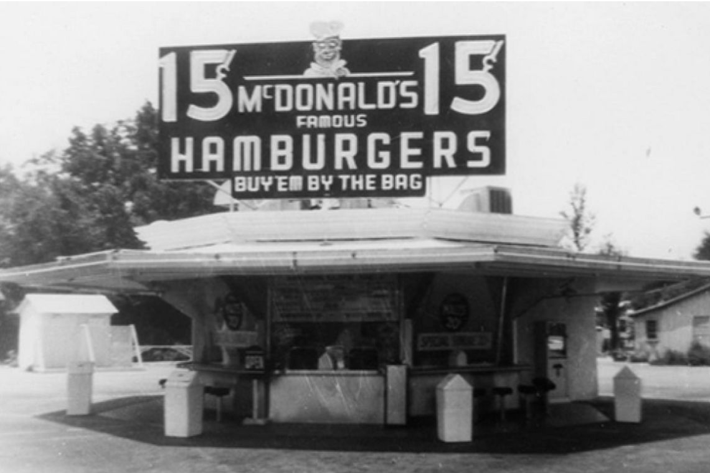
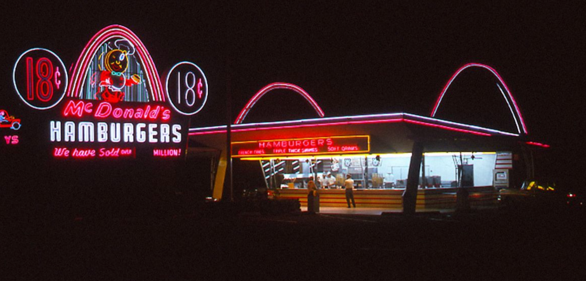
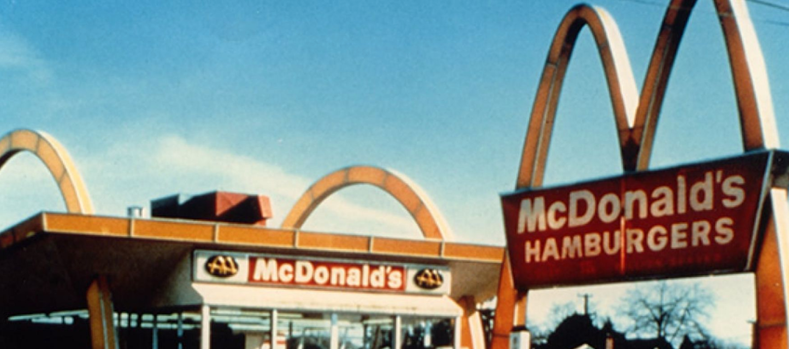
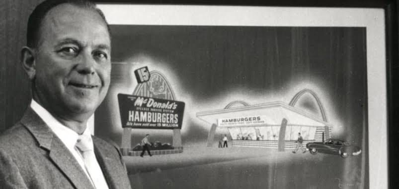

When we think of a startup, we think of a company revolutionizing artificial intelligence or creating self-driving cars – tech of the new age. But, at its essence, a startup is just a venture that creates a unique, innovative solution that solves a specific problem. To that end, it may surprise you that many companies we might think of as sclerotic, unoriginal behemoths started out as startups. Chief among them is McDonald's – the company which created fast food as we know it, reinventing the restaurant industry.

So how did McDonalds go from just a small restaurant in San Bernardino, California to a global giant with over 43,000 locations in over a hundred countries?

**Ideation**

 

    <figure class="col-md-12">
        
        <figcaption>The original McDonald’s, started by Dick and Mac McDonald</figcaption>
    </figure>

 

Brothers Richard “Dick” and Maurice “Mac” McDonald first attempted to break into the movie business, though this endeavour didn’t work out. So, they packed their bags and shifted from New England to California, trying their hand at the restaurant and food service industry. At first, they owned a small hot dog stand near the Santa Anita track in Arcadia, California.

However, they quickly realized a majority of their sales were from burgers, fries, and shakes. So, in 1948 they revamped their business. They realized that customers were tired of long wait times and high-prices. In order to combat this issue, the brothers cut the price – and wait-time – in half by taking a page from Henry Ford’s book.

Ford had pioneered the assembly line in the early 1900s to make large numbers of cars very quickly, making his company the largest automobile producer in the world. The McDonald brothers adapted this to the restaurant industry by creating the “Speedee Service System” – an assembly line for food. By simplifying the menu to 9 items and getting rid of carhops – waiters who delivered food to people in their cars – they could drastically improve efficiency.

So, they had their unique selling point – their innovation and contribution to the fast food industry. But what about their competitors and consumers?\
\
**Market Analysis**

 

    <figure class="col-md-12">
        
        <figcaption>A McDonald’s location in the 1960’s</figcaption>
    </figure>

 

Post-war America was a bustling place. After two decades of economic depression and a world war, the American populace was back in action. At the end of a long workday, they wanted a cheap, quick meal.

The food service industry, however, was still stuck in the past. Almost every restaurant was a sit-in location. The few that had attempted to innovate had adopted the concept of carhops as described earlier. Neither approach was able to match the speed or cost the American public desired.

Enter the Speedee Service System. Through the series of innovations described above, the McDonald brothers gave birth to the fast food industry.

But what stopped others from just copying their ideas?

**Marketing**

 

    <figure class="col-md-12">
        
        <figcaption>A McDonald’s restaurant with the iconic golden arches</figcaption>
    </figure>

 

While the McDonald's brothers were content keeping their chain small and their innovation unknown, they had a chance encounter with a shrewd businessman named Ray Kroc. Kroc was originally a distributor for a special milkshake mixing machine, but was so blown away by the Speedee Service System, he decided to change industries. In April 1955, Kroc launched McDonald’s Systems, Inc., later known as McDonald’s Corporation, in Des Plaines, Illinois. He would eventually go on to buy out the McDonald’s brothers in 1961, and would change the history of fast food forever, cementing the restaurant’s place in American culture.

Kroc marketed and franchised the chain on a scale the brothers could never have imagined. For example, in 1963, he introduced “Ronald McDonald”, the mascot for the chain. But arguably the most important change he made was the introduction of the golden arches – a symbol of McDonald's the world over.

By introducing these unique, colorful symbols, he ensured that McDonald's would not become “just another fast food restaurant,” but rather _the_ fast food restaurant.

Even with all of this marketing and innovation, the chain was still barely making any money. That’s when Harry Sonneborn came onto the scene.

********

**Finance**

 

    <figure class="col-md-12">
        
        <figcaption>Harry S. Sonneborn, the first President and CEO of McDonald’s, responsible for pivoting the business into real estate</figcaption>
    </figure>

 

At the end of the day, a startup is just a business, and like any business, it needs to make money. However, the food service industry has infamously low margins – more so when the goal of McDonald’s was to provide a cheap alternative to regular restaurants. Realizing this, Harry Sonneborn, a former vice-president of finance at an ice cream chain called Tastee-Freez, approached Ray Kroc.

He told Kroc that instead of relying on selling food as its main source of revenue, they should instead own the land restaurants were built on. The majority of McDonald's locations were not actually owned by the company. They were franchises – businesses which paid McDonald’s a small cut of their revenue in exchange for being allowed to brand themselves as a McDonald’s, whilst keeping operational control in their own hands. By buying plots of land and acting as the landlords to these franchisees, McDonalds could significantly improve their bottom line.

Sonneborn, who went on to become the CEO of McDonald's, later remarked, “we are not technically in the food business. We are in the real estate business.” And it was precisely this decision which turned an ordinary chain of fast-food restaurants into a thriving multinational.

********

**Conclusion**

The McDonald brothers revolutionized the food service industry with their Speedee Service System, cutting both preparation time and costs in half—something previously thought impossible. While competitors focused on expanding seating and hiring more carhops, they failed to recognize the growing demand for fast, affordable food. However, it was Ray Kroc’s impeccable branding and marketing which propelled McDonald’s to the forefront of the restaurant industry, making the golden arches a global symbol of fast food. All of this, combined with Sonneborn’s game-changing real estate strategy, transformed McDonald's into the billion-dollar empire it is today.

As we see with the case of McDonald’s, a startup is more than just an innovative idea. It’s about understanding the consumer, beating the competitors, and creating memorable marketing campaigns, all while being financially sustainable.

At E-Cell, we understand that entrepreneurship extends far beyond just building a product. It requires a deep awareness of the risks and challenges associated with disciplines like marketing and finance. It requires skills like competitor analysis and prototyping. To equip aspiring entrepreneurs in the IIIT community with these critical insights, we have launched StartUp Aid 2025.

Through StartUp Aid, we bring together entrepreneurs, investors, and industry leaders to share their expertise and real-world experiences, offering a glance into the different faces of entrepreneurship. We also give students the chance to pitch to real investors and potentially incubate their startup at IIIT’s in-house incubator, CIE.

Find the relevant details on the E-Cell website!

## References

[1] _Difference between a startup and a small business_ 
[https://wadhwanifoundation.org/difference-between-a-startup-and-a-small-business/](https://wadhwanifoundation.org/difference-between-a-startup-and-a-small-business/)

[2] _McDonald’s History_ 
[https://corporate.mcdonalds.com/corpmcd/our-company/who-we-are/our-history.html](https://corporate.mcdonalds.com/corpmcd/our-company/who-we-are/our-history.html)

[3] _Earnings_ 
[https://corporate.mcdonalds.com/content/dam/sites/corp/nfl/pdf/MCD-Q4-24-Earnings-Release.pdf](https://corporate.mcdonalds.com/content/dam/sites/corp/nfl/pdf/MCD-Q4-24-Earnings-Release.pdf)

[4] _The McDonald's Success Story_ 
[https://futureblind.com/p/the-mcdonalds-success-story](https://futureblind.com/p/the-mcdonalds-success-story)

[5] _History of the McDonald’s Franchise System_ 
[https://www.fmsfranchise.com/history-of-the-mcdonalds-franchise-system/](https://www.fmsfranchise.com/history-of-the-mcdonalds-franchise-system/)

[6] _History of McDonald's: Timeline and facts_ 
[https://www.thestreet.com/markets/history-of-mcdonalds-15128096](https://www.thestreet.com/markets/history-of-mcdonalds-15128096)

[7] _An article on McDonald’s by Britannica_ 
[https://www.britannica.com/money/McDonalds](https://www.britannica.com/money/McDonalds)

[8] _How McDonald's Makes Money_ 
[https://www.investopedia.com/articles/markets/032015/how-mcdonalds-makes-its-money-mcd.asp](https://www.investopedia.com/articles/markets/032015/how-mcdonalds-makes-its-money-mcd.asp)

[9] _3 Lessons We Can Learn from the Founders of McDonald’s_ 
[https\://medium.com/illumination/3-lessons-we-can-learn-from-the-founders-of-mcdonalds-e39df75fd138](https\://medium.com/illumination/3-lessons-we-can-learn-from-the-founders-of-mcdonalds-e39df75fd138)

[10] _McDonald's in South Korea, Taiwan hit by data breach_ 
[https\://www\.reuters.com/technology/mcdonalds-hit-by-data-breach-south-korea-taiwan-wsj-2021-06-11/](https\://www\.reuters.com/technology/mcdonalds-hit-by-data-breach-south-korea-taiwan-wsj-2021-06-11/)
