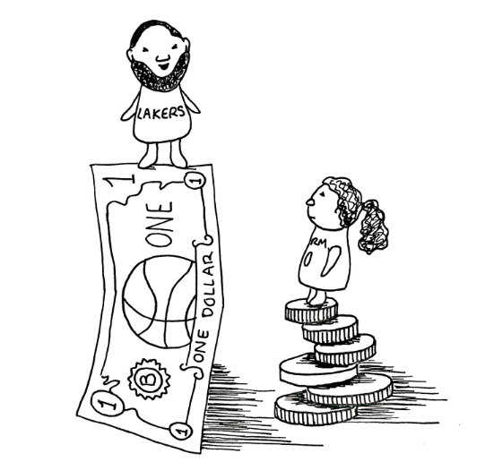
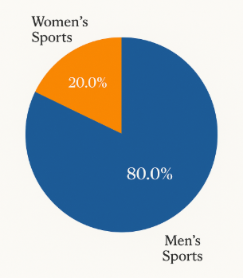
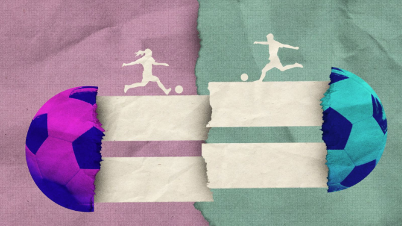

Sports has always been a platform for talent, hard work, and sheer resilience. But with respect to money, the huge gap between male and female athletes never seems to close. While progress has been made in gender equality, the pay gap has remained far too wide between male and female athletes. It begs very interesting questions, from fairness through market demand and into systemic bias.

In this article, we delve into reasons for the pay gap, the challenges being faced by female athletes, and the fight for equal pay in sports.

********

**Background and History**

There is a historical context to the gender pay gap in sports. During the first part of the 20th century, women showed limited interest in sports, as it was usually viewed as inappropriate behaviour. Many events forbade women from participating or presented them with opportunities fewer than their male counterparts. For example, women never took part in the first modern Olympic Games in 1896. Even when they were eventually allowed to compete starting in 1900, they were restricted to just a few sports like tennis and golf. 

The struggle against such discrimination by the mid-20th century was led by such eminent personalities as Billie Jean King. King, in 1973, had become the talk of the sporting world when she defeated Bobby Riggs in the "Battle of the Sexes," proving that women could compete with men and could be as entertaining as their male counterparts. Around the same time, Title IX legislation was enacted across the United States, requiring equal opportunities in athletic programs in education for women. This landmark legislation effectively encouraged increased participation in women's sports; however, the financial discrepancies remained.

These challenges continue to plague sports despite various achievements made by female athletes and rules imposed to aid them. Female athletes have had to assert their demands for equal prize money in many major tournaments. For example, in 1973, the U.S. Open became the first Grand Slam tournament to award equal prize money to male and female winners, but it took decades for others to follow suit. The FIFA Women's World Cup, which started in 1991, still suffers from tremendous disparities in prize money compared to the men's tournament. While it is true that progress has been registered,historical biases continue to affect the financial framework of women's sports.

********

**What is the Pay Gap Like?**

You would never believe how large the gender pay gap in sports is. The 2023 Forbes list of highest-paid athletes in the world featured 49 men and just one woman, Naomi Osaka. The gap does not end there. It also applies to team sports. In football, the U.S. Women's Team, which keeps winning, had to file a lawsuit to match the pay of the very unsuccessful U.S. Men's Team. The same can be seen in basketball. Women are given average salaries of around $130,000, while male players average at more than $9 million per year.

This is not an issue limited to the United States. Hopping over the Atlantic, the support given to the English women's cricket team is lackluster compared to the support that the men’s team receives. Prize money for both genders is fair on the Grand Slam level, but on other tiers of tournaments, females still earn lower pay. This is a scenario wherein women athletes have performed great feats and broken world records, only to be rewarded with low pay.

 

    <figure class="col-md-12">
        
        <figcaption>Credit: The Mossy Log</figcaption>
    </figure>

 

********

**Reasons behind the gap**

1. Less Money from Tickets and Sponsors

    A major cause of the gap is the simple fact that men’s sports earn more money. The NBA, FIFA Men’s World Cup, and NFL earn billions of dollars from ticket sales, TV deals, and sponsoring. Women’s sports generate income from fewer sponsors and in smaller amounts from TV contracts, which lowers the amount of accumulated salary and prize money.
    Yet, this is a bit of an infinite loop, as less media attention creates troubles for organizers to attract sponsors and fans. According to a 2019 report by Forbes, less than 10% of all sponsorship money goes to women’s sports. However, events like the Women’s World Cup and Women’s NBA playoffs prove that given proper exposure, women can attract a huge audience.

2. Less Media Coverage

    Media helps any sport to sustain itself financially. Women’s sports get less than 10% of all sports coverage worldwide. Men’s matches receive near-exclusive broadcast coverage, while women’s matches are relegated to non-prime time slots on lesser-known platforms. That means fewer sponsors, fewer fans, and thereby less revenue.
    The Women’s Sports Foundation says that when broadcasters treat women’s sports as less important, they don’t gain the same popular support. So, despite the fact that the U.S. Women’s National Team (USWNT) World Cup victory broke viewership records in 2019, they still found themselves fighting for equal pay.

3. Old Beliefs and Biases
    
    Traditionally, sports have been seen as a 'male activity', thus constraining women. Even with the advancements generated by laws such as Title IX, many still believe that women’s sports are inferior in competition. Some claim that men’s sports are more 'exciting' or 'intense', but evidence suggests that those qualities are equally present and strong in female competition.

4. Less Investment in Training and Facilities

    For decades, men's sports have been supported through funding for training centers, coaches, and recovery programs. In contrast, women's leagues typically receive far less support. Low investment inevitably limits opportunities for women in sports. In fact, many women athletes have to work part-time jobs to help support themselves – a phenomenon which is rarely present amongst professional male athletes. 
    According to a report by Adelphi University, funding for women's leagues is scarce in many countries. Without proper investment, they cannot grow or attract the best talent, and that, in turn, affects their performance and pay.
     
    

        <figure class="col-sm-8 ml-auto mr-auto">
            
            <figcaption>Women’s sports media coverage is expected to reach closer to 20% by the end of 2025. From The Shadows To The Spotlight, 2023, Credit: Wasserman’s The Collective</figcaption>
        </figure>
    

     

5. Unequal Prize Money

    The biggest difference in award amounts only makes the gap clearer. For winning the 2022 FIFA Men's World Cup, champions were awarded a prize amount of $42 million, while the 2023 Women's World Cup champions received a paltry sum of $4 million. Even sports like tennis, which have made great strides in awarding equal prize money during major tournaments, have a pay gap in smaller competitions. 
    A UCL management school study revealed that event organizers mostly allocate prize money according to the profit projected from the event. As women's sports have traditionally attracted very little investment, these projections remain low, and the inequality cycle continues. 

********

**Fight for Equal Pay**

1. Legal Realms and Collective Bargaining 

    Athletes are pursuing legal avenues for equal pay now more than ever. In 2019, the USWNT took the United States Soccer Federation to court for discrimination against women based on their gender. This eventually resulted in a settlement in 2022 granting equal pay to both the men's and women's teams.
    
2. Company and Fan Support

    Businesses and corporations are slowly realizing that there is value in women's sports. As such, many big names like Nike, Visa, and Barclays have availed money to female sports women and leagues to enhance visibility and support financially.

********

**Conclusion: The Road to Equality in Sports**

 

    <figure class="col-md-12">
        
        <figcaption>Female soccer players earn 25 cents to the dollar of men at World Cup, new CNN analysis finds, 2023, Credit: CNN</figcaption>
    </figure>

 

The just cause of equal pay in the sports is beyond money – it is tied with fairness, acknowledgment, and dignity of female athletes. However, there remain many hurdles such as upfront views, differences in investments, and systemic issues, which continue to fuel the gap. Bridging the pay gap requires continuous efforts from athletes alongside governing bodies, sponsors, and fans alike.

Women’s sports, given investment and visibility, show great promise. Legal victories, corporate sponsorship, and increased media publicizing will bring us a step closer toward achieving this potential. However, the ultimate equality will only come when women's sports receive recognition and resources on equal par with men.

Let us pay homage to the phenomenal achievements by female athletes on the field and, more importantly, let us make the effort to strive for a better future of having talent and dedication drive an athlete's merit, instead of gender. Equal pay in sports isn't just a women issue- it's about creating a more just and inclusive sporting world for everyone.

********

## References

[1] _Why don’t women athletes get equal pay?_ 
[https://finshots.in/archive/why-dont-women-athletes-get-equal-pay/](https://finshots.in/archive/why-dont-women-athletes-get-equal-pay/)

[2] _The Fight for Equal Pay in Women’s Sports_ 
[https://www.womenssportsfoundation.org/education/fight-equal-pay-womens-sports/](https://www.womenssportsfoundation.org/education/fight-equal-pay-womens-sports/)

[3] _The Gender Pay Gap in Sports_ 
[https://online.adelphi.edu/articles/male-female-sports-salary/](https://online.adelphi.edu/articles/male-female-sports-salary/)

[4] _Gender Equality in Sports – Why Gender Equal Pay is So Hard to Achieve in Sport_ 
[https://www.mgmt.ucl.ac.uk/news/gender-equality-sports-%E2%80%93-why-gender-equal-pay-so-hard-achieve-sport](https://www.mgmt.ucl.ac.uk/news/gender-equality-sports-%E2%80%93-why-gender-equal-pay-so-hard-achieve-sport)

[5] _I thought the main issue in women’s sports was equal pay. I was wrong_ 
[https://www.theguardian.com/sport/2019/may/09/i-thought-the-main-issue-in-womens-sports-was-equal-pay-i-was-wrong](https://www.theguardian.com/sport/2019/may/09/i-thought-the-main-issue-in-womens-sports-was-equal-pay-i-was-wrong)

[6] _Gender Inequality in Sports: Challenges and the Path to Equality_ 
[https://www.hindustantimes.com/ht-insight/gender-equality/gender-inequality-in-sports-challenges-and-the-path-to-equality-101727418715200.html](https://www.hindustantimes.com/ht-insight/gender-equality/gender-inequality-in-sports-challenges-and-the-path-to-equality-101727418715200.html)

[7] _How Unequal Pay and Unpredictable Earnings Cause Stress for Women in Sports_ 
[https://www.forbes.com/sites/brookchoulet/2024/12/22/how-unequal-pay-and-unpredictable-earnings-cause-stress-for-women-in-sports/](https://www.forbes.com/sites/brookchoulet/2024/12/22/how-unequal-pay-and-unpredictable-earnings-cause-stress-for-women-in-sports/)

[8] _Female soccer players earn 25 cents to the dollar of men at World Cup, new CNN analysis finds_ 
[https://edition.cnn.com/2023/07/20/football/womens-world-cup-pay-prize-money-spt-intl-dg/index.html](https://edition.cnn.com/2023/07/20/football/womens-world-cup-pay-prize-money-spt-intl-dg/index.html)

[9] _Wasserman-Collective-From-The-Shadows-to-the-Spotlight_ 
[https://www.teamwass.com/wp-content/uploads/2024/05/Wasserman-Collective-From-The-Shadows-to-the-Spotlight.pdf](https://www.teamwass.com/wp-content/uploads/2024/05/Wasserman-Collective-From-The-Shadows-to-the-Spotlight.pdf)

[10] _Gender pay gap in sports shines light on larger societal equity issues_ 
[https://mossylog.org/2020/10/30/gender-pay-gap-in-sports-shines-light-on-larger-societal-equity-issues/](https://mossylog.org/2020/10/30/gender-pay-gap-in-sports-shines-light-on-larger-societal-equity-issues/)

[11] _Empowering Excellence: Celebrating Women in Sport Across the Commonwealth_ 
[https://www.commonwealthsport.com/news/3923117/empowering-excellence-celebrating-women-in-sport-across-the-commonwealth](https://www.commonwealthsport.com/news/3923117/empowering-excellence-celebrating-women-in-sport-across-the-commonwealth)
