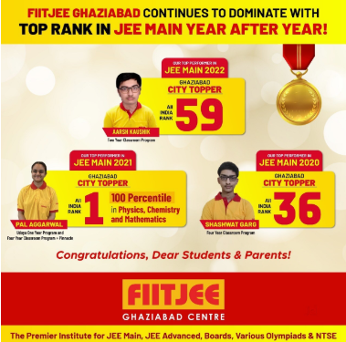
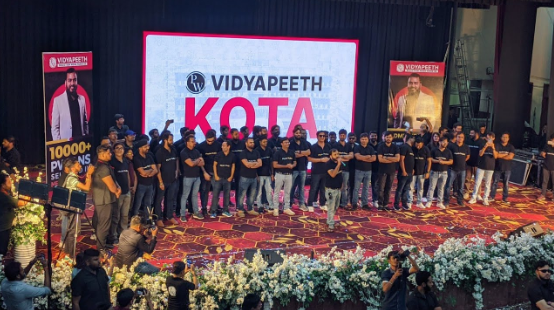
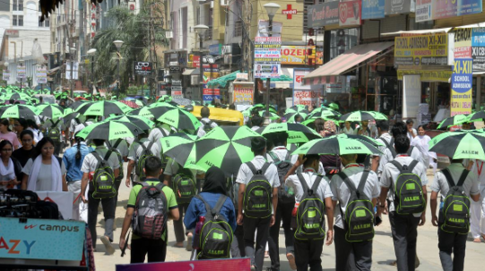

Every year, millions of Indian students chase a dream: cracking an entrance exam that can open the gates to a better life. Engineering, medicine, law — no matter the goal, there's an exam for it. And where there's an exam, there's a coaching institute ready to promise success, for a price. Over the years, this dream has transformed into a massive industry, one that capitalizes on ambition, anxiety, and aspiration. From the brick-and-mortar coaching giants of Kota to the edtech startups now worth billions, India has turned competitive exams into a thriving business. But while the coaching industry grows, the number of opportunities — college seats, government posts — has not kept pace. This has created a dangerous equation: more aspirants with fewer chances, making the exams even more hyper-competitive.

This article traces how we got here — and what it means for the future of learning in India.

********

**The Beginning**

Following the IT Boom in the 1990s, when multinational companies started setting up branches in India to outsource their projects, reducing labour costs, a lot of new high-paying jobs were created in the IT industry, rapidly increasing the appeal of getting an engineering degree <a href="#ref1">[1]</a>. With this increase in appeal, the popularity of entrance exams like AIEEE, which would later become the infamous JEE, exploded. This created a lot of aspirants, as people thought of IITs, NITs and IIITs as a surefire way to a successful career.

Soon, people began training specifically for these exams. Institutes like FIITJEE, Allen, and Aakash offered an alternative approach to the school curriculum, one that catered to the improvement of entrance exam scores, attracting a lot of aspirants. 

A similar situation happened within the realm of medical education. NEET-UG replaced the many small scale examinations held across the country with one centralized exam, which created a massive pool of students for coaching institutes.

********

**The Boom**

 

    <figure class="col-md-12">
        
        <figcaption>Billboards of the different coaching institutes in Kota<a href="#ref15">[15]</a></figcaption>
    </figure>

 

With the continuous rise in the popularity of JEE and NEET, coinciding with a period of rapid economic development and a general rise in living standards, more people could justify signing up for the generally expensive programs offered by these coaching institutes. 

These institutes often boasted their students’ good results. Their marketing ranged from huge billboards within cities and full page advertisements in newspapers, to posters behind rickshaws, making them a daily sight for the general public.

 

    <figure class="col-md-12">
        
        <figcaption>An Example of FIITJEE’s advertisements<a href="#ref16">[16]</a></figcaption>
    </figure>

 

Due to this, the finances of these institutes skyrocketed, greatly increasing their influence within our society. Moreover, with seemingly endless access to capital, these institutes start waging war against each other, competing for the best teachers in the industry<a href="#ref2">[2]</a><a href="#ref3">[3]</a>. One of these institutes, FIITJEE, even tried to enter the stock market, an action that would have, no doubt, ballooned its finances<a href="#ref4">[4]</a>.

********

**A Digital Revolution Within**

While these institutes were reaping massive profits, the ground was shifting under them. As internet access boomed across India, we saw the growth of edtech startups, including India’s first edtech unicorn, Byju’s, and other startups like Unacademy and Physics Wallah. The main catalyst for this transformation in the dynamics of this industry was YouTube.

No offline classroom can match the reach of a YouTube video. The above-mentioned startups usually started as a single teacher behind a video series or as a channel on YouTube. For example, Byju Raveendran for Byju’s, Alakh Pandey for Physics Wallah, or Gaurav Munjal for Unacademy. 

 

    <figure class="col-md-12">
        
        <figcaption>Alakh Pandey’s first videos - The start of Physics Wallah<a href="#ref17">[17]</a></figcaption>
    </figure>

 

This online approach slowly became popular within the industry, as the costs of maintaining offline classrooms did not affect these new startups. This allowed them to offer their courses for cheaper prices while maintaining significant margins. Since these tutoring videos were often a permanent stay on the platform, students could access these videos at any time, which gave them the option to customize their learning experience and tailor it to their own ability. 

Due to all these reasons, these institutes became the preferred mode of coaching for new aspirants. To convince parents who’d grown up in an era of books, these institutes invested heavily in better marketing, with celebrity endorsements (some readers can recall Shah Rukh Khan’s ads for Byju’s in the late 2010s) and sponsorships for popular events (Byju’s sponsoring the 2022 FIFA World Cup<a href="#ref5">[5]</a>) and sports teams.

 

    <figure class="col-md-12">
        
        <figcaption>Shah Rukh Khan as Byju’s celebrity spokesperson<a href="#ref18">[18]</a></figcaption>
    </figure>

 

Some of these institutes, like Physics Wallah, also have a better perception among the aspirants, due to the aforementioned  cost advantage and also the hyper-popularity of some of their teachers. For example, Alakh Pandey for Physics Wallah.

These advantages, combined with the onset of the COVID-19 pandemic, pushed these startups into the limelight, making them the new leaders in this profitable industry. These startups reached sky-high valuations, like Physics Wallah at $2.8 billion<a href="#ref6">[6]</a> and Unacademy at $3.4 billion<a href="#ref7">[7]</a><a href="#ref8">[8]</a>.

 

    <figure class="col-md-12">
        
        <figcaption>Physics Wallah’s promotional event for the Vidyapeeth program<a href="#ref19">[19]</a></figcaption>
    </figure>

 

********

**Fall of Old Giants**

The rise of online courses has spelled bad times for the older institutes. Institutes like Bansal Classes, which used to dominate the coaching sphere, are struggling to keep up with the times, facing lower revenue which has made it harder for them to retain their most sought-after tutors. This in turn reduces their popularity and demand, creating a vicious cycle of lowering profits.

Among the worst hit institutes was FIITJEE. The same company that had previously planned to go public refused to refund fees when the teachers weren't satisfactory or when centres closed down. They also stopped paying salaries to their teachers, citing poor performance of their centres<a href="#ref9">[9]</a>. This action is illegal under the Payment Of Wages Act, 1986<a href="#ref10">[10]</a>. Unsurprisingly, this also greatly reduced the retention of their teachers, further diminishing the quality of education. 

********

**The Current Situation**

Fuelled by these new startups, the coaching industry is bigger than ever. Some figures that express the current scale of the industry are as follows. 
- In 2022, the average Kota student paid 1.5 lakh a year in tuition, and educators estimated that there were around 3 lakh students admitted to Kota's numerous coachings. This translated to a market of 4500 crores in 2022 alone, only within Kota<a href="#ref11">[11]</a>.
- As per a survey on Education in India conducted by the National Statistical Office of India in 2017-18<a href="#ref12">[12]</a>, 19.8% of all students within India, nearly a fifth of our student population, have taken some form of private coaching. Also, on average, among the total expenditure made by the public towards education, 12% goes to coaching alone.

These figures are set to increase as the years go on, as the appeal of Tier 1 institutes is not something that is going to go away in the near future.

 

    <figure class="col-md-12">
        
        <figcaption>The students of Kota sporting Allen’s signature black and green Umbrellas<a href="#ref20">[20]</a></figcaption>
    </figure>

 

But a concerning revelation is that, while the number of aspirants continues to increase, the number of seats has remained comparatively stagnant. The number of seats at the most prestigious institutes in both the medical and engineering domains has not increased significantly, or at least on par with the growth in the number of aspirants. 

For example, the number of undergraduate medical seats has increased from 51,348 in 2014 to 1,09,170 in 2024, while 5,23,701 people wrote AIPMT 2014 (the predecessor exam to NEET) and 24,06,079 people wrote NEET 2024<a href="#ref13">[13]</a><a href="#ref14">[14]</a>. This means the ratio of approximately 1 seat to 10 aspirants in 2014 has more than doubled to 1 seat to 22 aspirants in 2024.

Today, coaching is no longer a supplement — it’s become a necessity. The industry’s reach has never been wider and its revenues have never been higher. But as seen earlier, this growth covers a disturbing truth: the number of opportunities hasn’t grown in step. For every extra student getting coached, there isn’t an extra seat or job waiting.

This imbalance turns preparation into pressure, ambition into anxiety. For students, entrance exams have become a high-stakes gamble — one that demands everything, often at the cost of mental health and self-worth. If left unchecked, this trend risks turning our education system into a factory of stress and disillusionment.

The question we must now ask is not whether coaching helps — but whether the system we’ve built is truly helping our students.

********

## References

[1] <em>The rise and fall of the Indian engineering degree</em> 
<a href="https://indianexpress.com/article/education/how-the-indian-engineering-degree-lost-its-sheen-this-decade-6182675/">https://indianexpress.com/article/education/how-the-indian-engineering-degree-lost-its-sheen-this-decade-6182675/</a>

[2] <em>The making of crorepati teachers</em> 
<a href="https://economictimes.indiatimes.com/industry/services/education/the-making-of-crorepati-teachers/articleshow/93704136.cms?from=mdr">https://economictimes.indiatimes.com/industry/services/education/the-making-of-crorepati-teachers/articleshow/93704136.cms?from=mdr</a>

[3] <em>Coaching and poaching in a Rajasthani city transformed by the business of aspiration</em> 
<a href="https://hindi.caravanmagazine.in/reportage/get-top">https://hindi.caravanmagazine.in/reportage/get-top</a>

[4] <em>FIITJEE seeks to list on Indian US exchanges</em> 
<a href="https://www.livemint.com/Companies/rIkxTI3sUNDiejQfehibaJ/FIITJEE-seeks-to-list-on-Indian-US-exchanges.html">https://www.livemint.com/Companies/rIkxTI3sUNDiejQfehibaJ/FIITJEE-seeks-to-list-on-Indian-US-exchanges.html</a>

[5] <em>BYJU'S announced as Official Sponsor of FIFA World Cup Qatar 2022</em> 
<a href="https://byjus.com/press/byjus-becomes-official-sponsor-for-fifa-world-cup-qatar-2022/">https://byjus.com/press/byjus-becomes-official-sponsor-for-fifa-world-cup-qatar-2022/</a>

[6] <em>India's Physics Wallah raises $210 mln, more than doubling valuation to $2.8 bln</em> 
<a href="https://www.reuters.com/markets/deals/indias-physics-wallah-raises-210-mln-more-than-doubling-valuation-28-bln-2024-09-20/">https://www.reuters.com/markets/deals/indias-physics-wallah-raises-210-mln-more-than-doubling-valuation-28-bln-2024-09-20/</a>

[7] <em>Ed-tech sector in India records 53% decline in investment to $877.5 million between January 2023 – till date</em> 
<a href="https://www.financialexpress.com/jobs-career/education-ed-tech-sector-in-india-records-53-decline-in-invest-to-877-5-million-between-january-2023-till-date-3147068/">https://www.financialexpress.com/jobs-career/education-ed-tech-sector-in-india-records-53-decline-in-invest-to-877-5-million-between-january-2023-till-date-3147068/</a>

[8] <em>Unacademy turns cash flow positive: CEO Gaurav Munjal says company has 4-year runway</em> 
<a href="https://www.moneycontrol.com/news/technology/unacademy-turns-cash-flow-positive-ceo-gaurav-munjal-says-company-has-4-year-cash-runway-11857511.html">https://www.moneycontrol.com/news/technology/unacademy-turns-cash-flow-positive-ceo-gaurav-munjal-says-company-has-4-year-cash-runway-11857511.html</a>

[9] <em>FIITJEE crisis: Centre closures, unpaid salaries, and legal troubles leave students and parents stranded</em> 
<a href="https://www.thehindu.com/education/fiitjee-crisis-centre-closures-unpaid-salaries-and-legal-troubles-leave-students-and-parents-stranded/article69548763.ece">https://www.thehindu.com/education/fiitjee-crisis-centre-closures-unpaid-salaries-and-legal-troubles-leave-students-and-parents-stranded/article69548763.ece</a>

[10] <em>The Payment Of Wages Act, 1936</em> 
<a href="https://indiankanoon.org/doc/794158/">https://indiankanoon.org/doc/794158/</a>

[11] <em>Notes from Kota: As edtechs slug it out, India's coaching capital is the ultimate winner</em> 
<a href="https://www.moneycontrol.com/news/business/startup/notes-from-kota-as-edtechs-slug-it-out-indias-coaching-capital-is-the-ultimate-winner-8888471.html">https://www.moneycontrol.com/news/business/startup/notes-from-kota-as-edtechs-slug-it-out-indias-coaching-capital-is-the-ultimate-winner-8888471.html</a>

[12] <em>Household Social Consumption on Education in India | Study by GoI, MSPI and NSO</em> 
<a href="https://mospi.gov.in/sites/default/files/publication_reports/Report_585_75th_round_Education_final_1507_0.pdf">https://mospi.gov.in/sites/default/files/publication_reports/Report_585_75th_round_Education_final_1507_0.pdf</a>

[13] <em>Rising UG medical seats</em> 
<a href="https://timesofindia.indiatimes.com/education/news/number-of-ug-medical-seats-has-increased-by-75-pg-by-93-since-2014-govt/articleshow/90374227.cms">https://timesofindia.indiatimes.com/education/news/number-of-ug-medical-seats-has-increased-by-75-pg-by-93-since-2014-govt/articleshow/90374227.cms</a>

[14] <em>National Eligibility cum Entrance Test (Undergraduate)</em> 
<a href="https://en.wikipedia.org/wiki/National_Eligibility_cum_Entrance_Test_(Undergraduate)">https://en.wikipedia.org/wiki/National_Eligibility_cum_Entrance_Test_(Undergraduate)</a>

[15] <em>The race for the Billboards Ranking</em> 
<a href="https://prakhar9.medium.com/the-race-for-the-billboards-ranking-f4767010eec9">https://prakhar9.medium.com/the-race-for-the-billboards-ranking-f4767010eec9</a>

[16] <em>FIITJEE Vaishali</em> 
<a href="https://www.justdial.com/Delhi/Fiitjee-Vaishali-Sector-3/011PXX11-XX11-171129114009-R9K3_BZDET">https://www.justdial.com/Delhi/Fiitjee-Vaishali-Sector-3/011PXX11-XX11-171129114009-R9K3_BZDET</a>

[17] <em>@PhysicsWallah | YT Channel</em> 
<a href="https://www.youtube.com/@PhysicsWallah">https://www.youtube.com/@PhysicsWallah</a>

[18] <em>Byju's featuring Shahrukh Khan is the most remembered brand during the ICC World Cup 2019: IIHB Survey</em> 
<a href="https://brandequity.economictimes.indiatimes.com/news/advertising/byjus-featuring-shahrukh-khan-is-the-most-remembered-brand-during-the-icc-world-cup-2019-iihb-survey/70027263">https://brandequity.economictimes.indiatimes.com/news/advertising/byjus-featuring-shahrukh-khan-is-the-most-remembered-brand-during-the-icc-world-cup-2019-iihb-survey/70027263</a>

[19] <em>PW Grand Entry in Kota | YT Video</em> 
<a href="https://www.youtube.com/watch?v=SxYQfDqFeHU">https://www.youtube.com/watch?v=SxYQfDqFeHU</a>

[20] <em>The stressful lives of students in Kota | Data</em> 
<a href="https://www.thehindu.com/data/the-stressful-lives-of-students-in-kota-data/article67513277.ece">https://www.thehindu.com/data/the-stressful-lives-of-students-in-kota-data/article67513277.ece</a>

