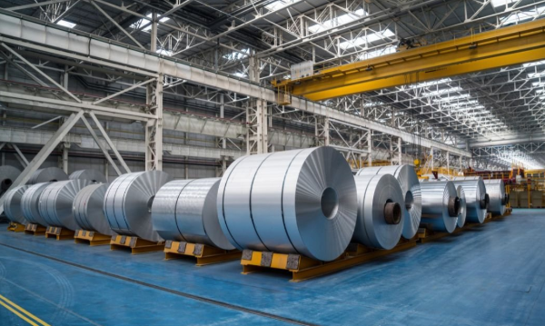
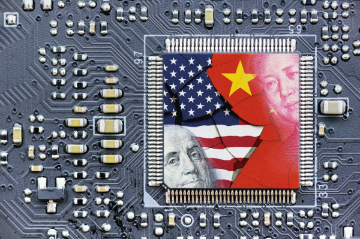
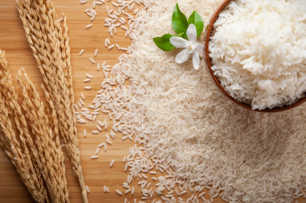

It’s 2025. Trump just announced a new wave of global tariffs, the kind that causes the stock market to dip and leaves doomsday financial experts screaming recession warnings. You, on the other hand, just want to know if the mess food will still be the same price next semester. Maybe you’ve been saving up for a laptop, or you finally convinced your parents to let you buy an air fryer for the hostel room. International trade wars always felt too far away to matter. But somehow quietly, they change the price of everything around you. And before you know it, the story of tariffs becomes your story too.

********

**What are Tariffs**

The Oxford dictionary defines tariff as <i>“a tax or duty to be paid on a particular class of imports or exports.”</i>

And for Trump, it's his weapon of choice in his “America First” agenda: heavy taxes on imports to promote domestic industries. In his inaugural address, he promised to boost American manufacturing and encourage greater investment. However, this crusade against globalism has had worldwide ramifications, including stock market volatility and retaliatory measures from around the world. Amidst the chaos, the US-China trade war takes centre stage. However, Indian industries are far from unaffected by these policies. So, what do Trump’s tariffs mean for the Indian consumer? 

********

**Metal Meltdown**

    <figure class="col-md-12">
        
        <figcaption>Rolls of aluminium sheets (Credits: Newsreel Asia)</figcaption>
    </figure>

Ever wondered why that basic metal shelf you bought for your hostel room might cost more next semester? Or why is the mess contractor holding off on a kitchen upgrade? With Trump’s tariffs blowing a huge hole through the global steel market, it’s becoming hard to ignore the chain reactions. This is where the metal meltdown begins.

$4.56 billion worth of steel and aluminium products were exported from India to the US in the 2025 financial year. It’s a substantial amount, and in this economy (or any economy for that matter), anyone would want a piece of that. 

In June 2025, US duties on steel and aluminium-based products doubled to 50%. This hefty tax would drastically reduce the export volume to the US. Most of these products are manufactured by medium-sized producers in Maharashtra, Gujarat, and Tamil Nadu; the impact on their income may be unsustainable, which could lead to massive job losses across the industry. 

It’s usually comforting to know that you’re not the only one suffering from a particular problem, and that there are others out there who relate. However, for the Indian steel industry, it's quite the opposite. The fact that other countries like South Korea and Vietnam are also affected by these tariffs poses a major challenge due to one simple phenomenon: trade diversion.

Scrambling for new markets to sell the steel that they can no longer export to the US, these countries are likely to divert trade to India and flood the market with cheap imports. These products undercut local producers with their competitive prices, and yet again, India’s manufacturing units are hit. While domestic producers face high competition and exporters suffer revenue losses, how exactly does this affect consumers? 

Nobody loves a bargain as much as Indians do, and initially, cheaper steel and aluminium imports abundant in the market seem like a huge win. However, this short-term gain is offset by a massive long-term loss. Trade tensions internationally fragment global supply chains and curb effective scaling. This increases costs, causing global prices to inevitably rise. You might think this is a far-fetched prediction. But the fact of the matter is that it has already happened in the aluminium markets. Ongoing US-China trade tensions have thrown production timelines off balance across the board, causing the commodity’s prices to steadily rise. 

The Indian government, already feeling the ground shifting under its feet, is not taking this lightly. In response to this flurry of instability, India is trying to seek a waiver on American tariffs similar to what the UK has already secured, as well as doubling down with a 12% duty on flat steel products, which went into effect on April 21, 2025.  The idea is to hold off the wave of cheaper imports and keep local producers from being priced out in their own market.

And while you may never buy a ton of steel, its price decides a lot more than you think, like whether your new hostel block gets built on time, or if the mess gets that long-promised kitchen revamp before your batch graduates.

That said, the fallout isn’t limited to steel and aluminium.

********

**The Semiconductor Shield and the Supply Chain Struggle**

    <figure class="col-md-12">
        
        <figcaption>Image of Benjamin Franklin and Mao Zedong overlaid on a semiconductor (Credits: Institute of Geoeconomics)</figcaption>
    </figure>

You’re in the lab, trying to get your circuit working and as usual, your sensor turns up defective again. The professor says the sensor is out of stock. Again. It’s always blamed on “supply chain issues.” That phrase has a lot to do with a global semiconductor mess, which just got messier thanks to Trump's tariff plans.

At first, semiconductor duties may seem irrelevant for India. India not only has negligible exports of semiconductors, but also has zero duties on its imports, making it immune to any retaliatory tariffs. But on closer inspection, a much more frightening truth is revealed. The direct impact of a 25% duty on semiconductor imports might be close to zero for India; however, these higher tariffs can snowball into worldwide chip pandemonium. 

Other countries with significant semiconductor trade with the US will be highly impacted by the tariffs, catalysing a global supply chain shift. Companies will now race to shift their purchasing to tariff-free regions, or choose to soften the blow by investing more in domestic production. Rome was not built in a day, and the supply chain cannot shift overnight; it is a time-consuming process that disrupts established supplier contracts, delays manufacturing and causes volatility in automotive, telecom and industrial sectors. Mitigating these will be expensive, and once again, where are these costs transferred? Of course, to the customer. Not only do they face increased costs, but they also face production delays caused by disruptions in the supply chain.

Nevertheless, there’s a silver lining to all this: recently, the US and China reached an agreement to lower their reciprocal tariff rates to 10%, a major reduction from previous peaks that reached as high as 145%. However, due to other existing duties, the effective tariff rate on most Chinese goods remains above 30%. Chinese component vendors are now losing out on US orders, forcing them to slash prices up to 5%, directly benefiting Indian importers.

Right in the middle of this global chip chaos, one blue-chip company has been playing the long game, and while others focused on contingency plans to mitigate losses, Apple had already made its move. 

In April 2025, 1.5 million iPhones were airlifted (or more fittingly, airdropped) from India to the US in a race to beat the tariffs. This clever airlift leveraged India’s minuscule tariff of 26% (as opposed to the then 125% for China), saving Apple billions. Apple had been long preparing for this trade war with China, evident by their strategic investments in Indian production during the pandemic.

But all of this pokes a hole straight through Trump’s “Make in America” campaign. Predictably, he didn’t take it well. The Trump administration soon threatened to levy a 25% tariff on iPhones unless Apple committed to moving production to the US entirely. So now, Apple’s stuck between two geopolitical juggernauts playing tug of war.

If Apple continues to base its production here in India, the upside could mean more jobs, stronger local infrastructure, and maybe even more affordable iPhones in the domestic market (but let's be honest, we’re still going to slap the 24-month EMI on it and pretend it was a smart financial decision).

********

**Apple’s Tango with Trump**

    <figure class="col-md-12">
        
        <figcaption>A man seen using his phone next to iPhone 16 models kept on display at the Apple store in Bandra Kurla Complex (BKC) in Mumbai (Credits: CNBC/Getty Images)</figcaption>
    </figure>

Right in the middle of this global chip chaos, one blue-chip company has been playing the long game, and while others focused on contingency plans to mitigate losses, Apple had already made its move. 

In April 2025, 1.5 million iPhones were airlifted (or more fittingly, airdropped) from India to the US in a race to beat the tariffs. This clever airlift leveraged India’s minuscule tariff of 26% (as opposed to the then 125% for China), saving Apple billions. Apple had been long preparing for this trade war with China, evident by their strategic investments in Indian production during the pandemic.

But all of this pokes a hole straight through Trump’s “Make in America” campaign. Predictably, he didn’t take it well. The Trump administration soon threatened to levy a 25% tariff on iPhones unless Apple committed to moving production to the US entirely. So now, Apple’s stuck between two geopolitical juggernauts playing tug of war.

If Apple continues to base its production here in India, the upside could mean more jobs, stronger local infrastructure, and maybe even more affordable iPhones in the domestic market (but let's be honest, we’re still going to slap the 24-month EMI on it and pretend it was a smart financial decision).

********

**Retaliation over Basmati Rice**

    <figure class="col-md-12">
        
        <figcaption>Basmati rice pictured with wheat (Credits: India Business and Trade)</figcaption>
    </figure>

Trump isn’t the only one with tariffs up his protectionist sleeve; India has traditionally imposed high tariffs in the agricultural industry to shield Indian farmers from global competition. India imposes an average tariff of 39% on agricultural goods from the US, compared to the US’s meagre 5%. Unfortunately, India hasn’t gotten away with this.

Under the “Fair and Reciprocal Plan,” Trump has hinted at retaliatory tariffs, and if that goes through, India’s $3.46 billion agricultural trade surplus with the US could take a serious hit.
That surplus primarily comes from exports like shrimp, basmati rice, and honey. If exports like basmati take a hit, it causes that surplus rice to stay at home, pulling prices down. This may seem like a temporary impact, but with farmers unable to recover costs, next season’s supply sinks and farmers quit, and that’s when prices start to climb.

The shots keep coming, as increased imports of American agricultural products like almonds and cotton further undercut domestic farmers in India. American almonds already dominate over 80% of the Indian market, and if the government follows through on plans to remove the 10% import duty on cotton, it could undercut Indian cotton prices badly. Farmers could be looking at losses up to ₹2,000 crore in unsold bales.

Similar to the steel and aluminium industry, the Indian consumer is initially met with a honeymoon period for agricultural product pricing. However, in the long term, if Indian farmers face reduced support, they either cut back on production or quit altogether, leaving a gap in supply. And a gap in supply inevitably means a huge climb in prices; and for students, that could be the difference between the mess serving fragrant basmati to serving broken low low-quality fodder as “Special Rice”. 

********

**What Next?**

India sits at a critical juncture. In one direction, there’s economic turbulence with input costs rising, exports shrinking, and local producers getting squeezed out by global competition. But on the other hand, there’s potential to take leadership in global supply chains, build resilient and tariff-proof domestic sectors, and reshape India’s role in international trade. 

But there are risks too. With rash policies and decisions, a single misstep is all it takes for India to become collateral in a war it didn’t start. 

Because at the end of the day, international trade wars don’t just play out in boardrooms and budget meetings. They silently echo through classrooms, mess halls and in the quiet calculations behind every EMI on a student’s laptop.

********

## References

[1] _Trump's new move could hammer India’s factories, and wreck exports and jobs_ 
[https://economictimes.indiatimes.com/industry/indl-goods/svs/metals-mining/donald-trump-steel-aluminium-50-pc-tariffs-impact-on-india-exports-local-manufacturing-prices-trade-diversion/articleshow/121638292.cms?from=mdr](https://economictimes.indiatimes.com/industry/indl-goods/svs/metals-mining/donald-trump-steel-aluminium-50-pc-tariffs-impact-on-india-exports-local-manufacturing-prices-trade-diversion/articleshow/121638292.cms?from=mdr)

[2] _Trump’s Semiconductor Tariff: A Non-Issue for India or a Hidden Risk_ 
[http://www.outlookbusiness.com/explainers/trumps-semiconductor-tariff-a-non-issue-for-india-or-a-hidden-risk](http://www.outlookbusiness.com/explainers/trumps-semiconductor-tariff-a-non-issue-for-india-or-a-hidden-risk)

[3] _Why Donald Trump's tariff war on China may mean discounts fo AC, TV, Fridge and other consumer electronics' buyers in India_ 
[timesofindia.indiatimes.com/technology/appliances/why-donald-trumps-tariff-war-on-china-may-mean-discounts-for-ac-tv-fridge-and-other-consumer-electronics-buyers-in-india/articleshow/120174872.cms](timesofindia.indiatimes.com/technology/appliances/why-donald-trumps-tariff-war-on-china-may-mean-discounts-for-ac-tv-fridge-and-other-consumer-electronics-buyers-in-india/articleshow/120174872.cms)

[4] _Trump’s Tariff Threat: Likely Impact on India’s Agriculture Trade_ 
[icrier.org/publications/trumps-tariff-threat-likely-impact-on-indias-agriculture-trade/](icrier.org/publications/trumps-tariff-threat-likely-impact-on-indias-agriculture-trade/)

[5] _Impact Of US Reciprocal Tariffs On India’s Agricultural Trade_ 
[upscgspedia.com/india-agriculture-trade-us-tariff-policy/](upscgspedia.com/india-agriculture-trade-us-tariff-policy/)

[6] _US tariffs on pharmaceuticals risk shortages of lower-cost generic drugs_ 
[www.ft.com/content/b5ed8bf5-fdd2-462b-a92c-96f0d985a685](www.ft.com/content/b5ed8bf5-fdd2-462b-a92c-96f0d985a685)

[7] _US tariff fallout: Experts weigh in impact on India's renewable energy sector_ 
[energy.economictimes.indiatimes.com/news/renewable/us-tariff-fallout-experts-weigh-in-impact-on-indias-renewable-energy-sector/120000686](energy.economictimes.indiatimes.com/news/renewable/us-tariff-fallout-experts-weigh-in-impact-on-indias-renewable-energy-sector/120000686)

[8] _Apple airlifts 600 tons of iPhones from India 'to beat' Trump tariffs, sources say_ 
[www.reuters.com/technology/apple-airlifts-600-tons-iphones-india-to-beat-trump-tariffs-sources-say-2025-04-10/](www.reuters.com/technology/apple-airlifts-600-tons-iphones-india-to-beat-trump-tariffs-sources-say-2025-04-10/)

[9] _India’s iPhone exports to the U.S. soared an estimated 76%. But Trump, Beijing won’t make further growth easy_ 
[www.cnbc.com/2025/05/27/indias-iphone-exports-to-the-us-soared-an-estimated-76percent-in-april.html](www.cnbc.com/2025/05/27/indias-iphone-exports-to-the-us-soared-an-estimated-76percent-in-april.html)

[10] _iPhone Manufacturing In India: How Will It Benefit Consumer Base In The Country?_ 
[www.cashify.in/manufacturing-apple-iphones-in-india-customer-benefit-price/](www.cashify.in/manufacturing-apple-iphones-in-india-customer-benefit-price)

[11] _Farmers’ body flags concern over relaxation of import norms on US almonds, poultry_ 
[indianexpress.com/article/cities/pune/farmers-body-flags-concern-over-relaxation-of-import-norms-on-us-almonds-poultry-8943248/](indianexpress.com/article/cities/pune/farmers-body-flags-concern-over-relaxation-of-import-norms-on-us-almonds-poultry-8943248/)

[12] _Centre Considering Removal of Cotton Import Duty; May Hurt Growers Ahead of Sowing Season_ 
[eng.ruralvoice.in/national/centre-considering-removal-of-cotton-import-duty-may-hurt-growers-ahead-of-growing-season.html](eng.ruralvoice.in/national/centre-considering-removal-of-cotton-import-duty-may-hurt-growers-ahead-of-growing-season.html)

[13] _Trump Targets India’s Agricultural Market_ 
[eng.ruralvoice.in/national/trump-targets-indias-agricultural-market-through-reciprocal-tariff.html](eng.ruralvoice.in/national/trump-targets-indias-agricultural-market-through-reciprocal-tariff.html)

[14] _Impact on India as Trump Imposes 25% Tariffs on Aluminium_ 
[newsreel.asia/articles/president-donald-trump-import-tariff-aluminium-india](newsreel.asia/articles/president-donald-trump-import-tariff-aluminium-india)

[15] _Looking back 20 years to learn lessons from the U.S.-Japan chip war_ 
[instituteofgeoeconomics.org/en/research/2023021644022/](instituteofgeoeconomics.org/en/research/2023021644022/)

[16] _Rice tariffs hit Asia—India stays competitive_ 
[www.indiabusinesstrade.in/blogs/asias-rice-exporters-hit-hard-by-oversupply-and-new-us-tariffs/](www.indiabusinesstrade.in/blogs/asias-rice-exporters-hit-hard-by-oversupply-and-new-us-tariffs/)

[17] _Why aluminium prices are rising and what to expect next_ 
[economictimes.indiatimes.com/markets/commodities/news/why-aluminium-prices-are-rising-and-what-to-expect-next/articleshow/121705106.cms](economictimes.indiatimes.com/markets/commodities/news/why-aluminium-prices-are-rising-and-what-to-expect-next/articleshow/121705106.cms)
