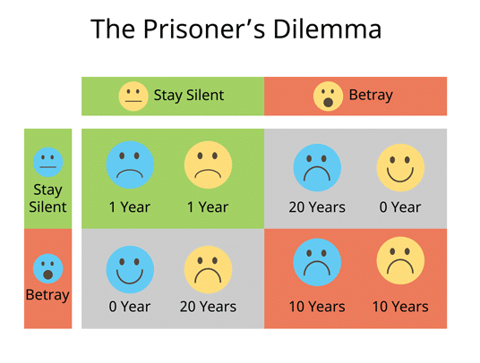
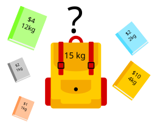

October 27, 1962. Vasili Arkhipov stands in a Soviet submarine hundreds of feet below the Atlantic Ocean, drenched in sweat and tension. From deep below the ocean, Arkhipov could hear explosions shaking the hull – American ships above are dropping bombs into the water.

The vessel has lost contact with Moscow, and the crew believes war has begun. Then comes the question that could change everything: Should we launch the nuclear torpedo?

Two senior officers say yes.

The launch code requires three.

All it would take is Arkhipov’s consent – a simple nod – and the world as they knew it could unravel into nuclear hellfire.

He says no.

His choice to wait, to question, to not retaliate quite literally saved the world. It wasn’t luck. It wasn’t peacekeeping, it was game theory in its most terrifying form: What does the rational player do when every option looks irrational?

However, game theory doesn’t just govern battlegrounds that echo with bombs; it applies just as much to awkward icebreakers and orientation events. After all, most games don’t look like Monopoly. They look like corridors lined with unfamiliar faces, signup sheets for endless formalities, and three-hour events where the only currency is creativity, wit, and maybe a packet of Kit-Kat. You’ve just stepped into college, no different from a stage. A theatre of choices where every glance, every misstep, every friendship is a scene in progress.

To help freshers dive into the world of entrepreneurship, E-Cell will be conducting an induction event packed with mini-games. Every mini-game is a curtain rising. In this theatre of choices, game theory becomes your script.

********

**Scene I: Trust or Trick**

Welcome to the prisoner’s dilemma.

It goes like this :

“Adam and Bianca are arrested for robbing a bank and placed in separate holding cells. The prosecutor individually presents both of them the following proposition: “You may choose to confess or remain silent. If one of you confesses and the other remains silent, the confessor will walk away free of charges, while the other faces 20 years in prison. If you both confess, both of you will face five years in prison. If neither of you confesses, then you both will face one year in prison.” <a href="#ref1">[1]</a>

    <figure class="col-md-12">
        
        <figcaption>Visual Description of the Prisoner’s Dilemma<a href="#ref5">[5]</a></figcaption>
    </figure>

If two players can benefit from cooperation, but risk losing out if one betrays the other – what do they do?

The prisoner’s dilemma has been heavily popularized in culture and media. In the 2001 film “A Beautiful Mind,” Russell Crowe, who plays the influential mathematician John F. Nash, famously explains the concept of the Nash equilibrium. He uses an analogy of men approaching women at a bar and states that instead of approaching the most beautiful woman, the men should pursue other women in the group to ensure less competition and a favorable outcome for everyone.

The film misses a key component of the prisoner’s dilemma. It implies that the unfavorable outcome, or equilibrium, can be avoided; however, a fundamental assumption of the prisoner’s dilemma is that everyone acts with self-interest. In the film scenario, all the gentlemen would compete over the “most beautiful woman”, as each man would act in their own self-interest – the dominant strategy.

In theory, mutual cooperation brings the best collective outcome. But in the chaos of games, trust is fragile, and betrayal is tempting. So here’s how to play the dilemma:
- Build short-term alliances early, while the rules (and people) are still unclear.
- Always assume others will act in their own interest – but look for overlaps with yours.

********

**Scene II: Where to Play?**

Every decision has a price – not just in what you choose, but what you give up by choosing it. This is called opportunity cost in game theory.

This Knapsack Problem plays out quietly, everyday. Which assignments to start first, which clubs to join, even which friend group to invest in.

You spread yourself too thin, and nothing sticks. Focus too narrowly and you might miss a better opportunity elsewhere. There’s no optimal strategy – only dynamic ones. You make the best choice with the information you have, then adapt.

In its classic form, the Knapsack Problem asks:

“Given a set of items, each with a weight and a value, determine which items to include in the collection so that the total weight is less than or equal to a given limit and the total value is as large as possible.”<a href="#ref2">[2]</a>

    <figure class="col-md-12">
        
        <figcaption></figcaption>
    </figure>

In your case, the capacity is time and energy, and items are mini-games and chocolates. You only have 3 hours and 3 players - that’s your budget.

Think in value-to-weight ratios. Some games offer 20 points for 2 minutes. Others promise 150 points for 25 minutes. Don’t be swayed by raw numbers. Focus on what each minute is worth.

Here’s where teams go wrong: they move as a “herd”, clustering around a single event. But there may be opportunities where dividing the team is advantageous as not every game requires full team participation. Just as crucial is knowing when to walk away. Remember to back out of a game before it ends up costing you the entire event.

And yes, sometimes the “low-effort” game no one’s paying attention to? That’s your hidden gem.

********

**Scene III: To Trade or Not To Trade**

Given the chance to cash in your points for a guaranteed reward, do you take the certainty – or gamble it all for a shot at something greater?

In classic Ultimatum Game setups, one player offers how to split a pot of money, and the other chooses to accept or reject. Game theory tells us that any non-zero offer should be accepted. Some gain is better than none. But in reality, players often reject “unfair” splits, even at their own cost. <a href="#ref3">[3]</a>

    <figure class="col-md-12">
        
        <figcaption></figcaption>
    </figure>

Emotion overrides logic.

You’ll be faced with the following conundrum:
- Trade too early, and you might slip on the leaderboard.
- Trade too late and your points might expire into regret.
- Hoard everything, and you miss the very joy the game offers.

The best teams don’t just play to win. They understand utility: the art of extracting the most value from each move, not just the most points.

********

**Curtain Call**

In the grand theatre of choices, every move – whether it's a calculated trade, a strategic alliance or the decision to walk away – is a performance. Through E-Cell’s induction event we aim to introduce freshers to the world of startups. These aren’t just mini-games. These are mini-mirrors to the entrepreneurial mindset: adaptability, calculated risk, resource allocation, and navigating human behaviour.

********

## References

[1] <em>Prisoner's Dilemma</em> 
<a href="https://thedecisionlab.com/reference-guide/psychology/prisoners-dilemma">https://thedecisionlab.com/reference-guide/psychology/prisoners-dilemma</a>

[2] <em>Knapsack Problem</em> 
<a href="https://en.wikipedia.org/wiki/Knapsack_problem">https://en.wikipedia.org/wiki/Knapsack_problem</a>

[3] <em>Ultimatum Game</em> 
<a href="https://en.wikipedia.org/wiki/Ultimatum_game">https://en.wikipedia.org/wiki/Ultimatum_game</a>

[4] <em>History of Cuban Missile Crisis</em> 
<a href="https://www.youtube.com/watch?v=bwWW3sbk4EU&feature=youtu.be">https://www.youtube.com/watch?v=bwWW3sbk4EU&feature=youtu.be</a>

[5] <em>Prisoner's Dilemma : 5 Relationship Lessons</em> 
<a href="https://mindhealth.com.au/the-prisoners-dilemma-5-relationship-lessons/">https://mindhealth.com.au/the-prisoners-dilemma-5-relationship-lessons/</a>

