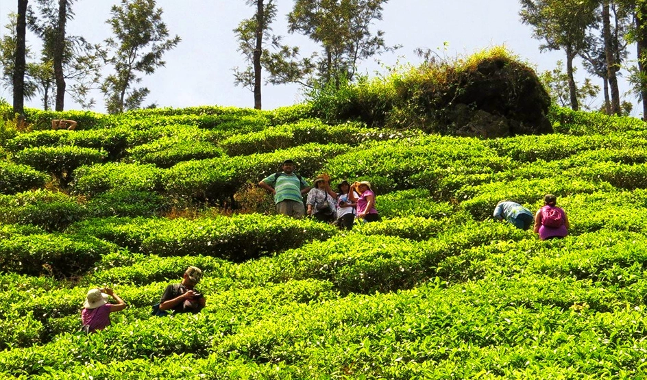
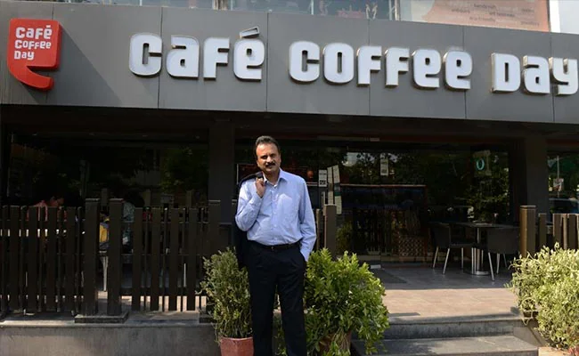
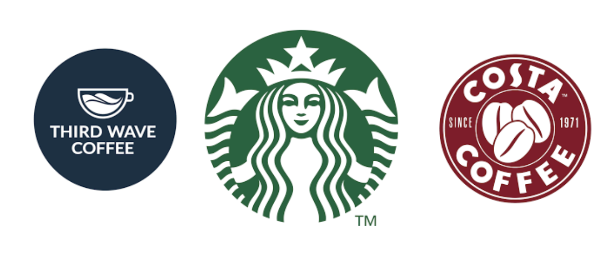
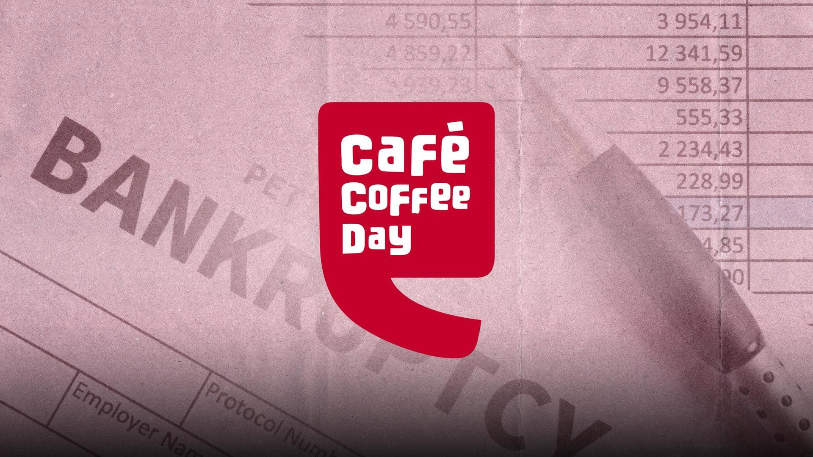
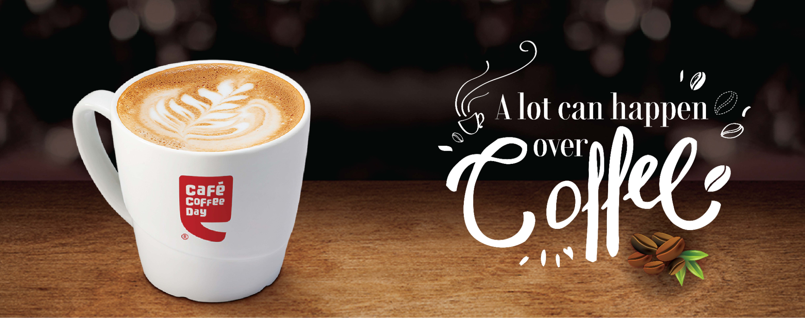

Millions of Indians start off their morning, enjoy short breaks, and rest after a long, hard day of work with the same beverage: chai or “tea” in English. In fact, India is the 4th largest consumer of tea in the entire world. So how then, did one man raise an empire worth as much as 10,000 crore rupees solely based on coffee? Join us as we look at the rise and fall of India’s beloved coffee giant, Cafe Coffee day, and the life and times of its visionary founder, V. G. Siddhartha.

********

**The Rise**

    <figure class="col-md-12">
        
    </figure>

Unbeknownst to many, India, while consuming copious amounts of tea, is also parallelly the eighth-largest producer of coffee – most of which is exported to the world. Areas like Chikkamagaluru in Karnataka have a rich history spanning centuries of producing some of the finest coffee in the world. And it is precisely here that V. G. Siddhartha was born.

His family had already been in the coffee farming business for over a century before his birth, but the young Siddhartha had different ambitions, hoping to serve in the Indian armed forces. As these dreams faltered, he pivoted to the stock market, leaving for Mumbai in 1983 to work for the prestigious JM Capital.

Two years later, he moved to Bangalore and started an investment firm on his own – Sivan Securities. He funneled the profits he made from this enterprise into buying up coffee plantations around Karnataka, eventually owning around 10,000 acres of plantations by 1993, when he finally decided to enter the coffee trading business by launching the Amalgamated Bean Company. The company started off small, making just six crores in profit in its first year.

In 1996, Siddhartha would expand from coffee trading to the business of cafes, opening his first location on the bustling Brigade Road of Bangalore.

********

**Limitless Growth?**

    <figure class="col-md-12">
        
    </figure>

Throughout the late 1990s and the 2000s, Cafe Coffee Day expanded exponentially, opening locations throughout the country. It further solidified its position in 2005 when it opened an international location in Vienna, Austria. It continued to expand internationally when it purchased the Czech cafe chain, Café Emporio, in 2010. 

In the midst of this expansion, V. G. Siddhartha was also busy diversifying away from the core cafe business, buying up everything from furniture makers to investing in Mindtree, a major IT company which would later prop up the debt-ridden Cafe Coffee Day – more on that later. Siddhartha also ventured into hospitality – through the Coffee Day Holiday Resorts – and real estate, via the Global Village Special Economic Zone (SEZ).

To support this massive expansion, international investment conglomerate Kohlberg Kravis Roberts (KKR) invested over 1,000 crore in Coffee Day Resorts. CCD also introduced a brand new logo and revamped the interiors of its stores, giving them a more modern look. 
This only supercharged the expansion of the chain, which reached the 1,000 café milestone by 2011.

********

**A Glance at the Industry**

    <figure class="col-md-12">
        
    </figure>

By the late 2010s, Cafe Coffee Day was India’s largest coffee chain, with over 1,700 locations and nearly 50,000 kiosks sold. But, how were its competitors doing – and more importantly, who were they? 

First, we have another Bangalore-based coffee chain which took the nation by storm: Third Wave Coffee. The chain quickly became popular amongst the tech crowd in Bengaluru, with their aesthetically pleasing locations offering fast service, memberships, subscriptions, coffee products, and their defining characteristic: community. TWC became one of the first cafes in India to fully embrace the progression of technology and, capitalizing on their tech-heavy user base, they released their own app with clean UI, brewing guides, provisions to order coffee products and much more.

Another one of CCD’s major competitors came from outside India – the undisputed king of the coffee bean – Starbucks. In terms of international presence, Starbucks outclasses every other competitor on this list. Because of its decades of experience, Starbucks has incorporated various features in its business model to bolster and solidify its profits; for example, their use of gift cards to cut costs. 

Lastly, we have Costa Coffee. Founded in 1971, Costa Coffee is known far and wide as the Starbucks of Europe. Boasting massive roasteries producing upwards of 45,000 tonnes of coffee in a year, and having a focus on sticking to the basics is the driving factor behind their success.

********

**The Fall**

    <figure class="col-md-12">
        
    </figure>

By 2019, Siddhartha’s over-extended coffee empire had become riddled with debt. Cafe Coffee Day had accumulated a total debt of around ₹6550 crore, causing the share price to hit a 13-year low. 

To combat this debt, Siddhartha had to sell his entire 20.32% stake in the IT services firm Mindtree to Larsen & Toubro. At the time of the sale, Siddhartha was the largest shareholder in the company. The deal netted him around 3,000 crore which helped CCD repay some of its creditors. 

However, the pressure from stakeholders and partners was simply too much to bear for V. G. Siddhartha. On July 27th, he wrote a letter addressed to shareholders claiming he had “failed as an entrepreneur”. Two days later, he went missing. And two days after that, on July 31st, fishermen found his body on the banks of the Nethravathi river near Mangalore in Karnataka.

The company went into near free-fall after his death, having to close down many of its locations. Yet, all was not lost for the iconic coffee giant. Siddhartha’s wife, Malavika Hegde – the daughter of S. M. Krishna, the former Chief Minister of Karnataka – stepped up to fill her husband’s shoes when she took over as CEO of the embattled enterprise in December 2020.

Over the next two years, she vowed to keep the prices of the chain’s signature products low. She also moved to close down unprofitable locations, focusing on making CCD’s operations more efficient. Moreover, she was also responsible for various other strategic initiatives such as partnering with the global investment firm Blackstone. All of this helped repay debtors and reduce the total debt from its nearly 7,000 crore rupee peak in 2019 to just over 450 crore in 2023. 

However, this was not enough to prevent CCD from nearly declaring bankruptcy after its failure to repay its debt to IndusInd Bank. It took over a month of negotiations for the insolvency litigation to be withdrawn and a settlement to be reached. 

********

**Conclusion**

    <figure class="col-md-12">
        
    </figure>

Today, Cafe Coffee Day is far from its peak – with over 900 outlets in India at the time of writing. Yet, all is not lost. The brand is slowly making a resurgence, continuously paying off its debts and reporting a net profit last quarter, despite increasing costs. The brand is now focused on profitability and sustainability rather than growth-at-all-costs expansion. 

The chain continues, albeit a husk of its former self. Will its burdens finally prove too big for it to overcome? Or will V. G. Siddhartha’s dream of creating a coffee empire be realized by his wife’s impeccable business acumen?

********

## References

[1] [https://economictimes.indiatimes.com/news/web-stories/list-of-countries-with-most-tea-drinkers-india-aint-the-no-1/slideshow/100443311.cms](https://economictimes.indiatimes.com/news/web-stories/list-of-countries-with-most-tea-drinkers-india-aint-the-no-1/slideshow/100443311.cms)

[2] [https://timesofindia.indiatimes.com/business/india-business/kkr-bain-tpg-eye-cafe-coffee-day-holding/articleshow/72063141.cms](https://timesofindia.indiatimes.com/business/india-business/kkr-bain-tpg-eye-cafe-coffee-day-holding/articleshow/72063141.cms)

[3] [https://www.livemint.com/companies/company-results/coffee-day-enterprises-q3-fy24-results-profit-at-rs-69-18cr-revenue-increased-by-5-36-yoy-11708033003087.html](https://www.livemint.com/companies/company-results/coffee-day-enterprises-q3-fy24-results-profit-at-rs-69-18cr-revenue-increased-by-5-36-yoy-11708033003087.html)

[4] [https://yourstory.com/2023/07/malavika-hegde-ccd-debt-turnaround-story](https://yourstory.com/2023/07/malavika-hegde-ccd-debt-turnaround-story)

[5] [https://www.moneycontrol.com/news/trends/legal/coffee-day-global-and-indusind-bank-reach-settlement-withdraw-insolvency-litigation-11355251.html](https://www.moneycontrol.com/news/trends/legal/coffee-day-global-and-indusind-bank-reach-settlement-withdraw-insolvency-litigation-11355251.html)

[6] [https://economictimes.indiatimes.com/news/politics-and-nation/v-g-siddhartha-from-son-of-coffee-planter-to-founder-of-indias-biggest-coffee-chain/articleshow/70452212.cms?from=mdr](https://economictimes.indiatimes.com/news/politics-and-nation/v-g-siddhartha-from-son-of-coffee-planter-to-founder-of-indias-biggest-coffee-chain/articleshow/70452212.cms?from=mdr)

[7] [https://economictimes.indiatimes.com/industry/cons-products/food/ccd-acquires-czech-republics-cafe-emporio/articleshow/6000571.cms?from=mdr](https://economictimes.indiatimes.com/industry/cons-products/food/ccd-acquires-czech-republics-cafe-emporio/articleshow/6000571.cms?from=mdr)

[8] [https://economictimes.indiatimes.com/industry/cons-products/food/ccd-acquires-czech-republics-cafe-emporio/articleshow/6000571.cms?from=mdr](https://economictimes.indiatimes.com/industry/cons-products/food/ccd-acquires-czech-republics-cafe-emporio/articleshow/6000571.cms?from=mdr)

[9] [https://www.businesstoday.in/magazine/cover-story/story/what-went-terribly-wrong-219883-2019-08-05](https://www.businesstoday.in/magazine/cover-story/story/what-went-terribly-wrong-219883-2019-08-05)

[10] [https://startuptalky.com/cafe-coffee-day-case-study/](https://startuptalky.com/cafe-coffee-day-case-study/)

[11] [https://economictimes.indiatimes.com/markets/stocks/news/the-curious-case-of-ccd-owner-vg-siddhartha-what-went-wrong/trapped-in-the-corner/slideshow/70463882.cms](https://economictimes.indiatimes.com/markets/stocks/news/the-curious-case-of-ccd-owner-vg-siddhartha-what-went-wrong/trapped-in-the-corner/slideshow/70463882.cms)

[12] [https://www.costa.co.uk/behind-the-beans/our-story/roastery#](https://www.costa.co.uk/behind-the-beans/our-story/roastery#)

[13] [https://www.coca-colacompany.com/media-center/the-coca-cola-company-completes-acquisition-of-costa](https://www.coca-colacompany.com/media-center/the-coca-cola-company-completes-acquisition-of-costa)

[14] [https://www.financialexpress.com/life/lifestyle-how-did-sushant-goel-spilled-the-beans-across-india-with-third-wave-coffee-know-how-his-entrepreneurial-journey-started-from-bootstrapping-in-his-college-dorm-3189279/](https://www.financialexpress.com/life/lifestyle-how-did-sushant-goel-spilled-the-beans-across-india-with-third-wave-coffee-know-how-his-entrepreneurial-journey-started-from-bootstrapping-in-his-college-dorm-3189279/)

[15] [https://www.worldcoffeeportal.com/Latest/News/2024/September/India-s-Cafe-Coffee-Day-posts-strong-revenue-growth](https://www.worldcoffeeportal.com/Latest/News/2024/September/India-s-Cafe-Coffee-Day-posts-strong-revenue-growth)

[16] [https://www.ndtv.com/india-news/vg-siddhartha-body-found-updates-body-of-missing-cafe-coffee-day-owner-vg-siddhartha-found-2077879](https://www.ndtv.com/india-news/vg-siddhartha-body-found-updates-body-of-missing-cafe-coffee-day-owner-vg-siddhartha-found-2077879)

[17] [https://www.newsbytesapp.com/news/business/cafe-coffee-day-operator-enters-insolvency/story](https://www.newsbytesapp.com/news/business/cafe-coffee-day-operator-enters-insolvency/story)
